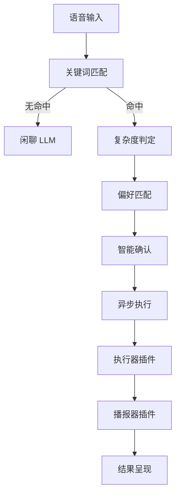

# 2.2 任务处理模块 - 产品需求文档

> **版本**：v1.6  
> **日期**：2026-01-20  
> **状态**：待审核

---

## 目录

- [一、版本目标](#一版本目标)
- [二、核心设计约束](#二核心设计约束)
- [三、系统架构与链路](#三系统架构与链路)
- [四、术语表](#四术语表)
- [五、任务系统核心概念](#五任务系统核心概念)
- [六、用户场景（P0）](#六用户场景p0)
- [七、边界情况与异常处理](#七边界情况与异常处理)
- [八、与现有功能整合](#八与现有功能整合)
- [九、插件化架构](#九插件化架构)
- [十、可观测性](#十可观测性)
- [十一、前端交互需求](#十一前端交互需求)
- [十二、度量指标](#十二度量指标)
- [十三、验收标准](#十三验收标准)
- [十四、后续扩展（P1/P2）](#十四后续扩展p1p2)

---

## 一、版本目标

在 2.0 多 Agent 协作架构基础上，新增**智能任务处理能力**：

- **多任务并行**：一次对话可触发多个任务
- **优先级管理**：用户可指定任务优先级
- **进度可追踪**：用户可随时查询进度
- **灵活中断**：任务可暂停、恢复、取消

---

## 二、核心设计约束

### 2.1 响应时效要求

> **核心约束：用户说完话后 2 秒内必须听到 AI 响应**

| 场景 | 响应策略 |
|------|----------|
| 闲聊 | 直接 LLM 响应，不经过任务系统 |
| 低复杂度 | 直接执行返回结果（< 2s） |
| 中/高复杂度 | 先返回安抚语，后台异步执行 |

### 2.2 链路耗时预算

```
用户说完 ─────────────────────────────> 2000ms 上限
    │
    ├─ ASR 完成 ─────────────────────> ~300ms
    ├─ 关键词检测 ───────────────────> ~50ms
    ├─ 无命中 → 闲聊 LLM ────────────> ~1500ms
    └─ 命中 → 快速响应 ──────────────> < 500ms
```

### 2.3 任务判断分层

```
第一层：关键词匹配 (~50ms)
├─ 无命中 → 直接闲聊（零延迟）
└─ 命中 → 进入任务流程

第二层：复杂度判定 (~50ms)
├─ 低 → 跳过确认，直接执行
├─ 中 → 检查偏好，有则跳过确认
└─ 高 → 智能分组确认
```

### 2.4 确认问题智能分组

| 问题类型 | 策略 |
|----------|------|
| 简单选择题 | 合并 2-3 个 |
| 开放性问题 | 单独问 |
| 依赖性问题 | 等答案后再问 |

```yaml
grouping:
  strategy: smart
  max_per_round: 2
```

---

## 三、系统架构与链路

### 3.1 架构图



### 3.2 链路总览

| 场景 | 链路 | 响应 |
|------|------|------|
| 闲聊 | 输入 → 无命中 → LLM | < 2s |
| 低复杂度 | 输入 → 执行 → 结果 | < 2s |
| 中/高 | 输入 → 安抚 → 异步 → 结果 | 安抚 < 2s |

---

## 四、术语表

| 术语 | 说明 |
|------|------|
| Task | 可追踪的后台任务 |
| Complexity | 复杂度：低/中/高 |
| Preference | 用户偏好记忆 |
| Executor | 执行器插件 |
| Hot Reload | 热更新 |

---

## 五、任务系统核心概念

### 5.1 复杂度分级

| 复杂度 | 处理策略 | 示例 |
|--------|----------|------|
| 低 | 直接执行 | 天气 |
| 中 | 安抚后执行 | 新闻 |
| 高 | 确认后执行 | 邮件 |

### 5.2 任务状态

`pending` → `confirmed` → `running` → `partial` → `completed`

可随时：`paused` / `cancelled` / `failed`

### 5.3 任务去重

> 避免同类型任务重复触发

| 场景 | 处理 |
|------|------|
| 相同任务执行中再次触发 | 提示"已在处理中，稍等" |
| 相同任务已完成再次触发 | 若结果未过期，询问"要看刚才的结果还是重新查？" |
| 不同参数的同类任务 | 允许创建新任务 |

### 5.4 资源限制

| 限制 | 默认值 |
|------|--------|
| 并发任务数 | 5 |
| 高复杂度任务数 | 2 |
| 超时 | 60s |

---

## 六、用户场景（P0）

### 6.1 基础场景

#### A. 闲聊（不受影响）
```
用户 → "心情不好"
[无命中，直接闲聊]
AI   → "怎么啦？"
```

#### B. 低复杂度
```
用户 → "今天天气"
AI   → "北京晴转多云，3-12度～"
[< 2s]
```

#### C. 中复杂度 + 偏好
```
用户 → "看看热点"
AI   → "还是科技类吗？"
用户 → "嗯"
AI   → "整理中～"
```

#### D. 高复杂度 + 智能确认
```
用户 → "整理邮件"
AI   → "整理哪个时间范围？有重点部门吗？"
[合并两个简单问题]
用户 → "今天的，产品部门"
AI   → "收到，处理中～"
```

---

### 6.2 确认中途被打断

> 用户在确认过程中突然聊别的

```
AI   → "整理哪个时间范围？"
用户 → "对了，今天天气怎么样？"
       ↓
[暂存确认上下文]
AI   → "北京今天晴～ 刚才说邮件，你要整理哪个时间范围的？"
       ↓
[处理完插入请求后，自动回到确认流程]
```

**处理规则**：
| 插入请求 | 处理方式 |
|----------|----------|
| 低复杂度任务 | 快速处理后自动回到确认 |
| 闲聊 | 简短回应后回到确认 |
| 另一个高复杂度任务 | 询问"先处理哪个" |
| 用户说"算了" | 取消当前确认 |

---

### 6.3 对结果不满意/要求重做

```
AI   → "整理好了，产品部门5封邮件..."
用户 → "不对，我要的是市场部门的"
       ↓
AI   → "抱歉弄错了，我重新整理市场部门的～"
[修正参数重做]
```

```
AI   → "今天3个热点..."
用户 → "太简单了，详细一点"
       ↓
AI   → "好的，详细说一下。第一条..."
[调整输出格式]
```

**支持的调整类型**：
| 用户反馈 | 处理 |
|----------|------|
| "不对，我要的是xx" | 修正参数重做 |
| "太简单/详细一点" | 调整输出格式 |
| "重新查一下" | 重新执行 |
| "换一个" | 重新获取（新闻等） |

---

### 6.4 ASR 识别错误纠正

```
用户说 → "北京天气"
ASR   → "背景天气"
AI    → "背景的天气..."
用户  → "不是背景，是北京"
         ↓
AI    → "哦北京，北京今天晴转多云～"
[理解纠正意图，重新执行]
```

**识别规则**：
- "不是xx，是yy" → 参数纠正
- "我说的是xx" → 重新理解
- 直接重复正确的 → 覆盖之前

---

### 6.5 同类任务重复触发

```
用户 → "帮我整理邮件"
[任务执行中]
用户 → "帮我整理邮件"
         ↓
AI   → "已经在整理了，稍等一下哦～"
```

```
[邮件任务刚完成]
用户 → "帮我整理邮件"
         ↓
AI   → "刚才已经整理过了，要看刚才的结果还是重新整理？"
```

---

### 6.6 多任务/优先级

```
用户 → "查新闻和整理邮件，邮件优先"
AI   → "收到，邮件优先，新闻同时处理～"
```

---

### 6.7 进度查询

```
用户 → "邮件整理得怎么样"
AI   → "已整理40%，产品部门完成了～"
```

---

### 6.8 暂停/恢复

```
用户 → "先暂停"
AI   → "好的～"
用户 → "继续刚才的"
AI   → "从断点继续～"
```

---

## 七、边界情况与异常处理

### 7.1 通话中断处理

| 场景 | 处理 |
|------|------|
| 任务执行中用户断开 | 任务继续执行，结果保留 |
| 用户重新连接 | 主动告知"刚才的xx已完成/在执行" |
| 结果保留时长 | 24小时 |
| 超时未连接 | 清理结果 |

```
[用户断开时任务执行中]
         ↓
[任务完成，结果保留]
         ↓
[用户重新连接]
AI   → "刚才帮你整理的邮件已经好了，要听一下吗？"
```

### 7.2 其他异常

| 异常 | 处理 |
|------|------|
| API 超时 | 人设化道歉 |
| 搜索无结果 | 直接告知 |
| 高复杂度取消 | 二次确认 |

---

## 八、与现有功能整合

### 8.1 任务与游戏

```
[游戏中]
用户 → "帮我查天气"
AI   → "先暂停游戏看天气，还是结束后再看？"
```

### 8.2 场景切换

| 时机 | 状态 |
|------|------|
| 后台执行中 | 闲聊状态 |
| 确认/播报 | 任务状态 |

---

## 九、插件化架构

### 9.1 插件类型

| 插件 | 说明 | 热加载 |
|------|------|--------|
| 触发器 | 判断是否触发 | ✓ |
| 执行器 | 执行任务逻辑 | ✓ |
| 播报器 | 结果转语音 | ✓ |

### 9.2 配置模板

```yaml
task:
  id: "email_summary"
  name: "邮件整理"
  version: "1.0"
  
  trigger:
    type: keyword
    keywords: ["邮件", "收件箱"]
  
  complexity: high
  
  # 去重配置
  dedup:
    enabled: true
    cache_ttl: 300  # 结果缓存5分钟
  
  preference:
    enabled: true
    fields: ["time_range", "department"]
  
  confirmation:
    grouping:
      strategy: smart
      max_per_round: 2
    questions:
      - text: "整理哪个时间范围？"
        param: time_range
        type: simple_choice
      - text: "有重点部门吗？"
        param: department
        type: simple_choice
  
  # 结果调整支持
  result_adjustment:
    format_modes: [brief, normal, detailed]
    default: normal
    retry_enabled: true
  
  executor:
    type: builtin
    hot_reload: true
  
  broadcaster:
    style: neutral
    emotion: calm
```

### 9.3 热加载

| 组件 | 热加载 |
|------|--------|
| 配置文件 | ✓ 文件监听 |
| 插件 | ✓ 动态 import |

---

## 十、可观测性

### 10.1 日志追踪

每个任务记录完整链路日志：

| 日志项 | 内容 |
|--------|------|
| 任务ID | 唯一标识 |
| 触发时间 | 用户请求时间 |
| 确认轮次 | 确认问答记录 |
| 执行耗时 | 各阶段耗时 |
| 状态变更 | 状态流转记录 |
| 最终结果 | 成功/失败/取消 |

### 10.2 监控指标

| 指标 | 说明 |
|------|------|
| 任务触发量 | 按类型统计 |
| 完成率 | 成功/失败比例 |
| 平均耗时 | 各复杂度耗时 |
| 首响延迟 | 是否满足2s |
| 重试率 | 用户要求重做比例 |

### 10.3 告警规则

| 告警 | 阈值 |
|------|------|
| 首响超时 | > 2s |
| 任务失败率 | > 5% |
| 执行超时 | > 配置时间 |

---

## 十一、前端交互需求

### 11.1 任务列表

```
┌───────────────────────────┐
│  📋 进行中 (2)             │
├───────────────────────────┤
│  🔴 邮件整理  ████░ 40%  │
│  ⏸️ 旅游规划  暂停        │
└───────────────────────────┘
```

### 11.2 结果卡片

完成后展示，确认后关闭

---

## 十二、度量指标

| 类型 | 指标 | 目标 |
|------|------|------|
| 响应 | 首响时间 | < 2s |
| 成功 | 完成率 | > 95% |
| 性能 | 低任务耗时 | < 2s |
| 体验 | 重做率 | < 10% |

---

## 十三、验收标准

| 场景 | 验收 |
|------|------|
| 闲聊 | 不受影响 |
| 低复杂度 | < 2s 返回 |
| 中/高复杂度 | < 2s 安抚 |
| 确认被打断 | 自动回到确认 |
| 结果调整 | 支持重做/调整格式 |
| ASR 纠正 | 理解纠正意图 |
| 任务去重 | 正确识别重复 |
| 通话中断 | 结果保留 |
| 热加载 | 无需重启 |

---

## 十四、后续扩展（P1/P2）

### P1
- 任务依赖关系
- 高级错误恢复
- 任务编辑

### P2
- 历史持久化
- 定时任务
- 用户自定义任务
- 成本控制/限流
- 灰度发布
