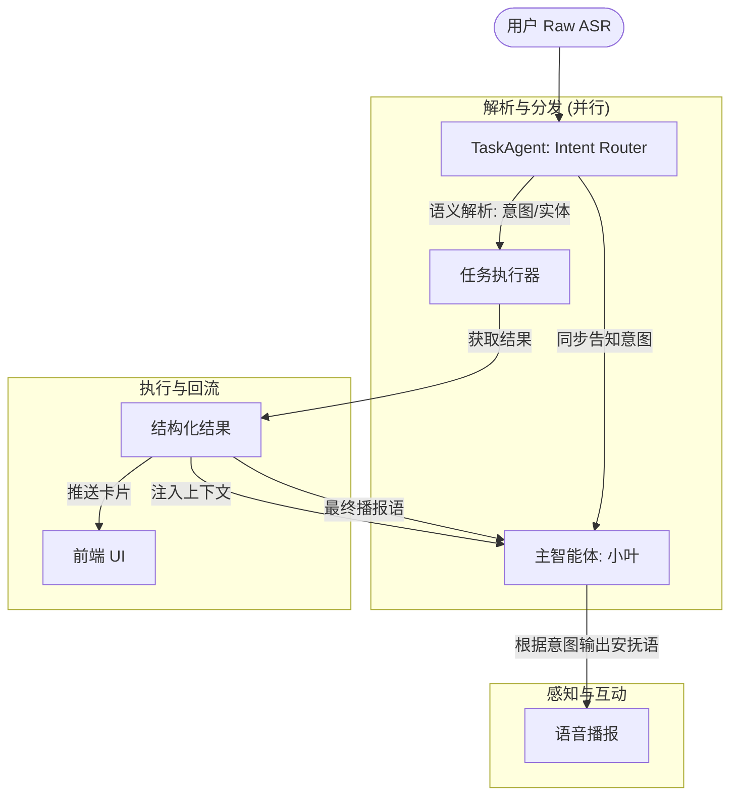

# 2.2 任务处理模块 - 核心架构文档

> **版本**：v1.0  
> **日期**：2026-01-20  
> **状态**：已确认  
> **性质**：完整架构设计，分版本实现

---

## 一、文档索引

本模块按以下版本逐步实现：

| 版本 | 文档 | 核心功能 | 状态 |
|------|------|----------|------|
| v2.2.0 | [MVP 版本](./2.2.0-MVP.md) | 天气查询 + 基础链路 | 待开发 |
| v2.2.1 | [中复杂度](./2.2.1-中复杂度.md) | 新闻整理 + 偏好记忆 | 待开发 |
| v2.2.2 | [高复杂度](./2.2.2-高复杂度.md) | 邮件整理 + 智能确认 | 待开发 |
| v2.2.3 | [多任务](./2.2.3-多任务.md) | 多任务并行 + 优先级 | 待开发 |
| v2.2.4 | [异常处理](./2.2.4-异常处理.md) | 边界情况 + 体验优化 | 待开发 |
| v2.2.5 | [插件化](./2.2.5-插件化.md) | 插件架构 + 可观测 | 待开发 |

---

## 二、核心设计约束

### 2.1 响应时效（全版本适用）

> **硬性要求：用户说完话后 2 秒内必须听到 AI 响应**

| 场景 | 响应策略 |
|------|----------|
| 闲聊 | 直接 LLM，不经过任务系统 |
| 低复杂度 | 直接执行返回（<2s） |
| 中/高复杂度 | 先安抚再异步执行 |

### 2.2 链路耗时预算

```
用户说完 ─────────────────────────> 2000ms 上限
    ├─ ASR 完成 ─────────────────> ~300ms
    ├─ 关键词检测 ───────────────> ~50ms
    ├─ 无命中 → 闲聊 ────────────> ~1500ms
    └─ 命中 → 快速响应 ──────────> <500ms
```

| 穿插对话 | 允许 | 在异步任务执行期间，用户可与主智能体进行闲聊，互不干扰 | v2.2.x |

---

## 三、核心设计：意图解析前置 (v2.2.0+)

为了解决提示词堆积、识别率波动以及“人设劣化”问题，系统放弃“标签模式”，全面采用“意图前置解析”架构。

### 3.1 去标签化
- **彻底废除**：不再要求主 LLM 在 `core.xml` 中识别意图并输出标签。
- **主入口迁移**：所有的 ASR 原始文本首先经过 `TaskAgent` 的 NLU 层。

### 3.2 职责解耦
- **理性脑 (TaskAgent)**：负责语义理解、意图分类（Intent）、实体提取（Entity）。使用高精度模型（如 qwen-max）确保识别率。
- **感性脑 (MainLLM)**：专注于情感回复、场景演绎。仅在任务启动时接收“信号”进行告知，任务完成后接收“结果”进行播报。

### 3.1 核心逻辑流 (Intent-First)



### 3.2 职责解耦
- **TaskAgent (理性脑)**：唯一入口。负责 ASR 文本解析、意图提取、工具调用。**严禁**主 LLM 参与解析逻辑。
- **主智能体 (感性脑)**：不再感知 `[ACTION:TASK]`。仅作为感知侧：1. 接收解析器的“意图信号”进行安抚；2. 接收执行器的“结果数据”进行播报。

```
v2.2.0 (MVP)
    │
    ▼
v2.2.1 (中复杂度)
    │
    ▼
v2.2.2 (高复杂度)
    │
    ├─────────────┐
    ▼             ▼
v2.2.3 (多任务) v2.2.4 (异常)
    │             │
    └──────┬──────┘
           ▼
     v2.2.5 (插件化)
```

---

## 四、任务复杂度分级

| 复杂度 | 定义 | 处理策略 | 版本 |
|--------|------|----------|------|
| **低** | 立即返回 | 直接执行 | v2.2.0 |
| **中** | 安抚后完成 | 偏好 + 异步 | v2.2.1 |
| **高** | 需要确认 | 智能确认 + 子任务 | v2.2.2 |

---

## 五、任务状态

```
pending → confirmed → running → partial → completed
                        ↓
                     paused / cancelled / failed
```

---

## 六、核心功能清单

### 6.1 v2.2.0 - MVP
- [x] 关键词触发检测
- [x] 复杂度分级框架
- [x] 低复杂度任务（天气）
- [x] 基础配置模板
- [x] 天气卡片
- [x] 2s 响应保障

### 6.2 v2.2.1 - 中复杂度
- [ ] 中复杂度任务（新闻）
- [ ] 用户偏好记忆
- [ ] 安抚语机制
- [ ] 后台异步执行
- [ ] 新闻卡片

### 6.3 v2.2.2 - 高复杂度
- [ ] 高复杂度任务（邮件）
- [ ] 智能确认分组
- [ ] 子任务拆分
- [ ] 部分结果汇报
- [ ] 进度查询

### 6.4 v2.2.3 - 多任务
- [ ] 多任务解析
- [ ] 优先级管理
- [ ] 任务去重
- [ ] 暂停/恢复
- [ ] 任务列表面板

### 6.5 v2.2.4 - 异常处理
- [ ] 确认中途被打断
- [ ] 结果调整/重做
- [ ] ASR 纠正理解
- [ ] 通话中断处理
- [ ] 超时处理

### 6.6 v2.2.5 - 插件化
- [ ] 执行器插件化
- [ ] 播报器插件化
- [ ] 配置热加载
- [ ] 链路日志
- [ ] 监控告警

---

## 七、配置模板完整结构

```yaml
task:
  id: "task_id"
  name: "任务名称"
  version: "1.0"
  
  # 触发
  trigger:
    type: keyword | regex | semantic
    keywords: []
    handler: null  # 自定义插件路径
  
  complexity: low | medium | high
  
  # 去重 (v2.2.3)
  dedup:
    enabled: true
    cache_ttl: 300
  
  # 偏好 (v2.2.1)
  preference:
    enabled: true
    fields: []
  
  # 确认 (v2.2.2)
  confirmation:
    grouping:
      strategy: smart
      max_per_round: 2
    questions: []
  
  # 子任务 (v2.2.2)
  subtasks:
    enabled: false
    split_strategy: ""
    partial_report: true
  
  # 结果调整 (v2.2.4)
  result_adjustment:
    format_modes: [brief, normal, detailed]
    retry_enabled: true
  
  # 执行器 (v2.2.5)
  executor:
    type: builtin | custom
    handler: null
    hot_reload: true
  
  # 播报器 (v2.2.5)
  broadcaster:
    style: persona | neutral
    emotion: happy | calm
    handler: null
  
  # 超时
  timeout:
    duration: 60s
    notify: true
```

---

## 八、术语表

| 术语 | 说明 |
|------|------|
| Task | 可追踪的后台任务 |
| Complexity | 复杂度：低/中/高 |
| Preference | 用户偏好记忆 |
| Executor | 执行器插件 |
| Broadcaster | 播报器插件 |
| SubTask | 子任务 |
| Hot Reload | 热更新 |

---

## 十一、废弃说明

自 v2.2.0 重构起，以下机制已被废弃：
1. **[DEPRECATED] 标签解析模式**：不再使用 `[ACTION:TASK:type]`。
2. **[DEPRECATED] 关键词前端匹配**：前端不再负责关键词拦截，所有文本由服务端意图路由器（Intent Router）决策。

