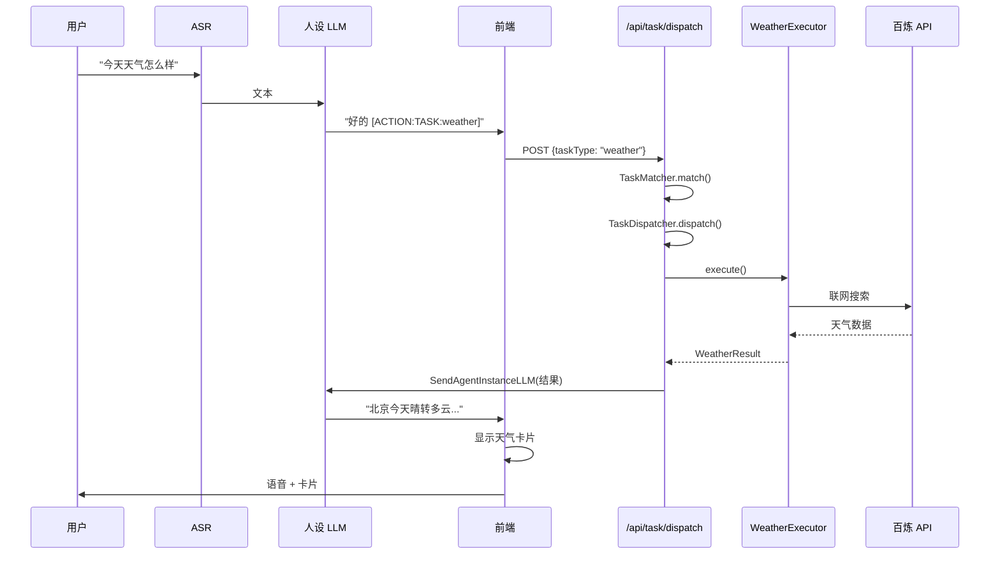

# v2.2.0 MVP - 技术方案

> **版本**：v2.2.0  
> **日期**：2026-01-20  
> **状态**：待审核  
> **关联 PRD**：[v2.2.0 MVP PRD](./2.2.0-MVP.md)  
> **核心架构**：[技术方案-核心架构](./技术方案-核心架构.md)

---

## 一、版本范围

### 1.1 交付功能

- ✅ 关键词触发检测（不影响闲聊）
- ✅ 复杂度分级框架
- ✅ 低复杂度任务执行（天气查询）
- ✅ 基础配置模板解析
- ✅ 天气结果卡片
- ✅ 2s 响应保障

### 1.2 不包含

- ❌ 用户偏好记忆（v2.2.1）
- ❌ 异步执行（v2.2.1）
- ❌ 确认流程（v2.2.2）
- ❌ 多任务（v2.2.3）

---

## 二、技术架构

### 2.1 模块关系

```
用户输入
    │
    ▼
┌──────────────────────────────────────────────────────────────┐
│ ActionDetector (现有)                                        │
│ 检测 [ACTION:TASK:xxx] 标签                                  │
└──────────────────────────────────────────────────────────────┘
    │
    ▼
┌──────────────────────────────────────────────────────────────┐
│ /api/task/dispatch                                           │
│ 任务调度入口                                                  │
└──────────────────────────────────────────────────────────────┘
    │
    ▼
┌──────────────────────────────────────────────────────────────┐
│ TaskMatcher                                                  │
│ 加载配置 → 关键词匹配 → 返回匹配结果                           │
└──────────────────────────────────────────────────────────────┘
    │
    ▼
┌──────────────────────────────────────────────────────────────┐
│ TaskDispatcher                                               │
│ 创建会话 → 判断复杂度 → 分发执行                              │
└──────────────────────────────────────────────────────────────┘
    │
    ▼
┌──────────────────────────────────────────────────────────────┐
│ WeatherExecutor                                              │
│ 调用百炼 API → 解析结果                                       │
└──────────────────────────────────────────────────────────────┘
    │
    ▼
┌──────────────────────────────────────────────────────────────┐
│ PersonaBroadcaster                                           │
│ 格式化结果 → 人设化播报                                       │
└──────────────────────────────────────────────────────────────┘
    │
    ▼
┌──────────────────────────────────────────────────────────────┐
│ SendAgentInstanceLLM                                         │
│ 注入结果到人设 LLM                                            │
└──────────────────────────────────────────────────────────────┘
```

### 2.2 数据流时序



---

## 三、文件结构

### 3.1 新增文件

```
Source/server/
├── app/api/task/
│   └── dispatch/
│       └── route.ts           # [NEW] 任务调度 API
│
├── lib/tasks/
│   ├── index.ts               # [NEW] 模块导出
│   ├── types.ts               # [NEW] 类型定义
│   │
│   ├── core/
│   │   ├── task-matcher.ts    # [NEW] 任务匹配器
│   │   ├── task-dispatcher.ts # [NEW] 任务调度器
│   │   ├── task-session.ts    # [NEW] 会话管理
│   │   └── config-loader.ts   # [NEW] 配置加载
│   │
│   ├── executors/
│   │   ├── base-executor.ts   # [NEW] 执行器基类
│   │   └── weather-executor.ts# [NEW] 天气执行器
│   │
│   └── broadcasters/
│       ├── base-broadcaster.ts    # [NEW] 播报器基类
│       └── persona-broadcaster.ts # [NEW] 人设化播报
│
├── config/tasks/
│   └── weather.yaml           # [NEW] 天气任务配置
│
└── data/tasks/                # [NEW] 任务数据目录
```

### 3.2 修改文件

```
Source/web/src/
├── hooks/zego/
│   └── useActionDetector.ts   # [MODIFY] 添加任务 ACTION 处理
│
└── components/call/
    ├── CallPage.tsx           # [MODIFY] 添加天气卡片渲染
    └── WeatherCard.tsx        # [NEW] 天气卡片组件
```

---

## 四、核心实现

### 4.1 类型定义

```typescript
// lib/tasks/types.ts

export type TaskComplexity = 'low' | 'medium' | 'high';
export type TaskStatus = 'pending' | 'running' | 'completed' | 'failed';

export interface TaskConfig {
  id: string;
  name: string;
  version: string;
  trigger: {
    type: 'keyword';
    keywords: string[];
  };
  complexity: TaskComplexity;
  params?: TaskParam[];
  executor: {
    type: 'builtin';
    handler: string;
  };
  broadcaster: {
    style: 'persona' | 'neutral';
    emotion: string;
  };
  timeout: {
    duration: string;
  };
}

export interface TaskParam {
  name: string;
  source: 'input' | 'memory';
  default_memory_key?: string;
}

export interface TaskSession {
  taskId: string;
  configId: string;
  roomId: string;
  userId: string;
  status: TaskStatus;
  params: Record<string, any>;
  result?: TaskResult;
  error?: string;
  createdAt: number;
}

export interface TaskResult {
  success: boolean;
  data: any;
}

export interface WeatherResult {
  location: string;
  temperature: string;
  weather: string;
  suggestion: string;
  iconCode: string;
}
```

### 4.2 任务匹配器

```typescript
// lib/tasks/core/task-matcher.ts

import { TaskConfig } from '../types';
import { ConfigLoader } from './config-loader';

export interface MatchResult {
  configId: string;
  config: TaskConfig;
  extractedParams: Record<string, any>;
}

export class TaskMatcher {
  private static instance: TaskMatcher;
  private configLoader: ConfigLoader;
  
  static getInstance(): TaskMatcher {
    if (!this.instance) {
      this.instance = new TaskMatcher();
    }
    return this.instance;
  }
  
  constructor() {
    this.configLoader = ConfigLoader.getInstance();
  }
  
  /**
   * 匹配任务
   * @param input 用户输入文本
   * @returns 匹配结果，无匹配返回 null
   */
  match(input: string): MatchResult | null {
    const configs = this.configLoader.getAllConfigs();
    
    for (const config of configs) {
      if (this.matchKeywords(input, config.trigger.keywords)) {
        return {
          configId: config.id,
          config,
          extractedParams: this.extractParams(input, config)
        };
      }
    }
    
    return null;
  }
  
  private matchKeywords(input: string, keywords: string[]): boolean {
    const normalized = input.toLowerCase();
    return keywords.some(kw => normalized.includes(kw.toLowerCase()));
  }
  
  private extractParams(input: string, config: TaskConfig): Record<string, any> {
    const params: Record<string, any> = {};
    
    // 提取地点（简单实现，后续可优化）
    const locationMatch = input.match(/(.{2,4}?)(的)?(天气|温度)/);
    if (locationMatch && locationMatch[1]) {
      params.location = locationMatch[1];
    }
    
    return params;
  }
}
```

### 4.3 任务调度器

```typescript
// lib/tasks/core/task-dispatcher.ts

import { TaskSession, TaskStatus } from '../types';
import { TaskMatcher, MatchResult } from './task-matcher';
import { WeatherExecutor } from '../executors/weather-executor';
import { PersonaBroadcaster } from '../broadcasters/persona-broadcaster';
import { MemoryManager } from '@/lib/memory-manager';
import { sendAgentInstanceLLM } from '@/lib/zego-api';

export class TaskDispatcher {
  private static instance: TaskDispatcher;
  private sessions: Map<string, TaskSession> = new Map();
  
  static getInstance(): TaskDispatcher {
    if (!this.instance) {
      this.instance = new TaskDispatcher();
    }
    return this.instance;
  }
  
  /**
   * 分发任务
   */
  async dispatch(
    roomId: string,
    userId: string,
    instanceId: string,
    taskType: string,
    inputParams: Record<string, any>
  ): Promise<TaskSession> {
    // 1. 获取配置
    const matcher = TaskMatcher.getInstance();
    const config = matcher.getConfigById(taskType);
    
    if (!config) {
      throw new Error(`Unknown task type: ${taskType}`);
    }
    
    // 2. 创建会话
    const session = this.createSession(roomId, userId, config.id, inputParams);
    
    // 3. 补充参数（从用户记忆）
    await this.fillParamsFromMemory(session, config, userId);
    
    // 4. 根据复杂度处理
    if (config.complexity === 'low') {
      // 低复杂度：直接执行
      await this.executeAndBroadcast(session, instanceId);
    }
    // 中/高复杂度在后续版本实现
    
    return session;
  }
  
  private createSession(
    roomId: string,
    userId: string,
    configId: string,
    params: Record<string, any>
  ): TaskSession {
    const taskId = `task_${Date.now()}_${Math.random().toString(36).slice(2, 8)}`;
    
    const session: TaskSession = {
      taskId,
      configId,
      roomId,
      userId,
      status: 'running',
      params,
      createdAt: Date.now()
    };
    
    this.sessions.set(taskId, session);
    return session;
  }
  
  private async fillParamsFromMemory(
    session: TaskSession,
    config: TaskConfig,
    userId: string
  ): Promise<void> {
    // 如果没有地点参数，从用户记忆获取
    if (!session.params.location) {
      const memory = await MemoryManager.getInstance().getUserMemory(userId, 'xiaoye');
      
      if (memory?.targetUser) {
        const match = memory.targetUser.match(/(?:住在|常驻|位于|在)([^\s,，。]+)/);
        if (match) {
          session.params.location = match[1];
        }
      }
      
      // 默认值
      if (!session.params.location) {
        session.params.location = '北京';
      }
    }
  }
  
  private async executeAndBroadcast(
    session: TaskSession,
    instanceId: string
  ): Promise<void> {
    try {
      // 执行
      const executor = new WeatherExecutor();
      const result = await executor.execute(session);
      
      session.result = result;
      session.status = 'completed';
      
      // 播报
      const broadcaster = new PersonaBroadcaster();
      const broadcastText = broadcaster.format(result, session.configId);
      
      // 注入到 LLM
      await sendAgentInstanceLLM(instanceId, session.roomId, broadcastText);
      
    } catch (error) {
      session.status = 'failed';
      session.error = error.message;
      throw error;
    }
  }
}
```

### 4.4 天气执行器

```typescript
// lib/tasks/executors/weather-executor.ts

import { BaseExecutor } from './base-executor';
import { TaskSession, TaskResult, WeatherResult } from '../types';
import { BailianClient } from '@/lib/bailian-client';

export class WeatherExecutor extends BaseExecutor {
  readonly id = 'weather';
  
  private bailianClient: BailianClient;
  
  constructor() {
    super();
    this.bailianClient = new BailianClient();
  }
  
  async execute(session: TaskSession): Promise<TaskResult> {
    const location = session.params.location;
    
    // 1. 调用百炼联网搜索
    const query = `${location}今天天气 温度 穿衣建议`;
    const searchResult = await this.bailianClient.search(query);
    
    // 2. 解析结果
    const weatherData = await this.parseWeatherResult(searchResult, location);
    
    return {
      success: true,
      data: weatherData
    };
  }
  
  private async parseWeatherResult(
    raw: any,
    location: string
  ): Promise<WeatherResult> {
    // 使用 LLM 解析搜索结果
    const parsePrompt = `
请从以下搜索结果中提取天气信息，输出 JSON 格式：

搜索结果：
${JSON.stringify(raw)}

输出格式：
{
  "location": "${location}",
  "temperature": "最低-最高°C",
  "weather": "天气描述",
  "suggestion": "穿衣建议",
  "iconCode": "sunny|cloudy|rainy|snowy"
}

只输出 JSON，不要其他内容。
`;
    
    const response = await this.bailianClient.chat(parsePrompt);
    return JSON.parse(response);
  }
}
```

### 4.5 人设化播报器

```typescript
// lib/tasks/broadcasters/persona-broadcaster.ts

import { BaseBroadcaster } from './base-broadcaster';
import { TaskResult, WeatherResult } from '../types';
import { ConfigLoader } from '../core/config-loader';

export class PersonaBroadcaster extends BaseBroadcaster {
  readonly id = 'persona';
  
  format(result: TaskResult, configId: string): string {
    const config = ConfigLoader.getInstance().getConfig(configId);
    
    if (configId === 'weather') {
      return this.formatWeather(result.data as WeatherResult);
    }
    
    return JSON.stringify(result.data);
  }
  
  private formatWeather(data: WeatherResult): string {
    const { location, temperature, weather, suggestion } = data;
    
    // 人设化播报模板
    const templates = [
      `${location}今天${weather}，气温${temperature}，${this.personalizeSuggestion(suggestion)}`,
      `${location}今天是${weather}的天气，${temperature}，${this.personalizeSuggestion(suggestion)}`,
    ];
    
    // 随机选择模板
    const template = templates[Math.floor(Math.random() * templates.length)];
    return template;
  }
  
  private personalizeSuggestion(suggestion: string): string {
    // 添加人设化关心语
    const suffixes = [
      '记得穿厚一点哦～',
      '注意保暖呀～',
      '出门记得带伞哦～',
      '今天适合出去走走呢～'
    ];
    
    if (suggestion.includes('厚') || suggestion.includes('保暖')) {
      return '有点凉哦，' + suffixes[0];
    } else if (suggestion.includes('伞') || suggestion.includes('雨')) {
      return suffixes[2];
    } else {
      return suffixes[3];
    }
  }
}
```

### 4.6 配置加载器

```typescript
// lib/tasks/core/config-loader.ts

import fs from 'fs';
import path from 'path';
import yaml from 'yaml';
import { TaskConfig } from '../types';

export class ConfigLoader {
  private static instance: ConfigLoader;
  private configs: Map<string, TaskConfig> = new Map();
  private configDir: string;
  
  static getInstance(): ConfigLoader {
    if (!this.instance) {
      this.instance = new ConfigLoader();
    }
    return this.instance;
  }
  
  constructor() {
    this.configDir = path.join(process.cwd(), 'config/tasks');
    this.loadAllConfigs();
  }
  
  private loadAllConfigs(): void {
    if (!fs.existsSync(this.configDir)) {
      fs.mkdirSync(this.configDir, { recursive: true });
      return;
    }
    
    const files = fs.readdirSync(this.configDir);
    
    for (const file of files) {
      if (file.endsWith('.yaml')) {
        this.loadConfig(path.join(this.configDir, file));
      }
    }
  }
  
  private loadConfig(filepath: string): void {
    try {
      const content = fs.readFileSync(filepath, 'utf-8');
      const data = yaml.parse(content) as { task: TaskConfig };
      
      if (data.task?.id) {
        this.configs.set(data.task.id, data.task);
        console.log(`[ConfigLoader] Loaded: ${data.task.id}`);
      }
    } catch (error) {
      console.error(`[ConfigLoader] Failed to load ${filepath}:`, error);
    }
  }
  
  getConfig(id: string): TaskConfig | undefined {
    return this.configs.get(id);
  }
  
  getAllConfigs(): TaskConfig[] {
    return Array.from(this.configs.values());
  }
}
```

### 4.7 API 路由

```typescript
// app/api/task/dispatch/route.ts

import { NextRequest, NextResponse } from 'next/server';
import { TaskDispatcher } from '@/lib/tasks/core/task-dispatcher';

export async function POST(request: NextRequest) {
  try {
    const body = await request.json();
    const { taskType, params, instanceId, roomId, userId } = body;
    
    // 参数校验
    if (!taskType || !instanceId || !roomId || !userId) {
      return NextResponse.json(
        { error: 'Missing required parameters' },
        { status: 400 }
      );
    }
    
    // 分发任务
    const dispatcher = TaskDispatcher.getInstance();
    const session = await dispatcher.dispatch(
      roomId,
      userId,
      instanceId,
      taskType,
      params || {}
    );
    
    return NextResponse.json({
      taskId: session.taskId,
      status: session.status,
      result: session.result
    });
    
  } catch (error) {
    console.error('[Task Dispatch Error]', error);
    return NextResponse.json(
      { error: error.message },
      { status: 500 }
    );
  }
}
```

---

## 五、任务配置

```yaml
# config/tasks/weather.yaml
task:
  id: weather
  name: 天气查询
  version: "1.0"
  
  trigger:
    type: keyword
    keywords:
      - 天气
      - 温度
      - 穿什么
      - 热不热
      - 冷不冷
      - 会下雨
  
  complexity: low
  
  params:
    - name: location
      source: input
      fallback: memory
      default_memory_key: user_location
  
  executor:
    type: builtin
    handler: weather
  
  broadcaster:
    style: persona
    emotion: happy
  
  timeout:
    duration: 5s
```

---

## 六、前端改动

### 6.1 ACTION 检测扩展

```typescript
// hooks/zego/useActionDetector.ts (修改)

// 添加任务 ACTION 类型
const TASK_ACTIONS = ['TASK:weather'];

// 在 handleAction 中添加
async function handleAction(action: ParsedAction) {
  if (action.type.startsWith('TASK:')) {
    const taskType = action.type.replace('TASK:', '');
    
    const response = await fetch('/api/task/dispatch', {
      method: 'POST',
      headers: { 'Content-Type': 'application/json' },
      body: JSON.stringify({
        taskType,
        params: action.params || {},
        instanceId,
        roomId,
        userId
      })
    });
    
    const result = await response.json();
    
    if (result.status === 'completed' && taskType === 'weather') {
      setWeatherCard(result.result.data);
    }
  }
}
```

### 6.2 天气卡片组件

```tsx
// components/call/WeatherCard.tsx

import React from 'react';

interface WeatherCardProps {
  data: {
    location: string;
    temperature: string;
    weather: string;
    suggestion: string;
    iconCode: string;
  };
  onClose: () => void;
}

const WEATHER_ICONS: Record<string, string> = {
  sunny: '☀️',
  cloudy: '☁️',
  rainy: '🌧️',
  snowy: '❄️'
};

export function WeatherCard({ data, onClose }: WeatherCardProps) {
  const icon = WEATHER_ICONS[data.iconCode] || '🌤️';
  
  return (
    <div className="weather-card">
      <div className="weather-header">
        <span className="weather-icon">{icon}</span>
        <span className="weather-location">{data.location}</span>
      </div>
      
      <div className="weather-body">
        <div className="weather-temp">{data.temperature}</div>
        <div className="weather-desc">{data.weather}</div>
      </div>
      
      <div className="weather-footer">
        <span className="weather-suggestion">👔 穿衣建议：{data.suggestion}</span>
      </div>
      
      <button className="weather-close" onClick={onClose}>✕</button>
    </div>
  );
}
```

---

## 七、Prompt 扩展

### 7.1 任务触发规则

在 `core.xml` 中添加：

```xml
<task_trigger_rules>
  当用户表达以下意图时，输出对应 ACTION 标签：
  
  | 用户意图 | ACTION |
  |---------|--------|
  | 查天气/温度/穿什么 | [ACTION:TASK:weather] |
</task_trigger_rules>
```

---

## 八、开发步骤

### 8.1 后端开发顺序

1. **类型定义** - `lib/tasks/types.ts`
2. **配置加载** - `lib/tasks/core/config-loader.ts`
3. **天气配置** - `config/tasks/weather.yaml`
4. **任务匹配** - `lib/tasks/core/task-matcher.ts`
5. **执行器基类** - `lib/tasks/executors/base-executor.ts`
6. **天气执行器** - `lib/tasks/executors/weather-executor.ts`
7. **播报器** - `lib/tasks/broadcasters/persona-broadcaster.ts`
8. **任务调度** - `lib/tasks/core/task-dispatcher.ts`
9. **API 路由** - `app/api/task/dispatch/route.ts`

### 8.2 前端开发顺序

1. **天气卡片** - `components/call/WeatherCard.tsx`
2. **ACTION 扩展** - 修改 `useActionDetector.ts`
3. **CallPage 集成** - 添加卡片渲染

### 8.3 Prompt 修改

1. 修改 `config/prompts/agents/xiaoye/core.xml`

---

## 九、验收检查

| 检查项 | 验收标准 |
|--------|----------|
| 闲聊不受影响 | 非任务输入无延迟增加 |
| 天气查询 | "今天天气" 2s 内返回结果 |
| 默认地点 | 使用用户记忆常驻地 |
| 指定地点 | "上海天气" 正确查询上海 |
| 人设化播报 | 包含关心语 |
| 卡片显示 | 包含温度、天气、建议 |
| 卡片关闭 | 用户确认后关闭 |
