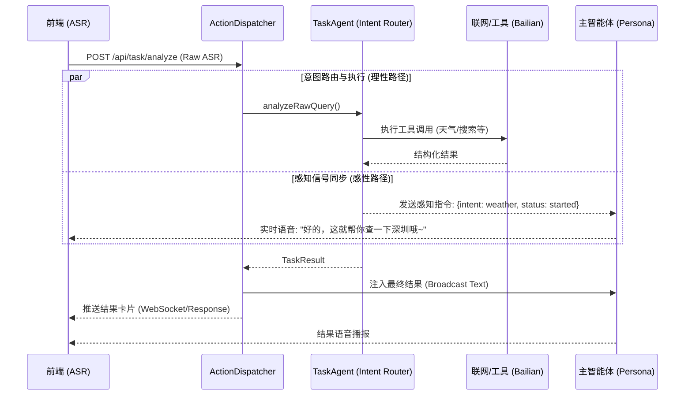

# 2.2 任务处理模块 - 核心架构技术方案

> **版本**：v1.0  
> **日期**：2026-01-20  
> **状态**：待审核  
> **关联 PRD**：[核心架构 PRD](./2.2-任务处理模块-核心架构.md)

---

## 一、整体架构

### 1.1 分层架构

```
┌─────────────────────────────────────────────────────────────────────┐
│                          前端 (Web)                                  │
│  ┌─────────────┐  ┌─────────────┐  ┌─────────────┐                 │
│  │ 语音输入     │  │ 结果卡片    │  │ 任务列表    │                 │
│  └─────────────┘  └─────────────┘  └─────────────┘                 │
└─────────────────────────────────────────────────────────────────────┘
                              │ HTTP / WebSocket
                              ▼
┌─────────────────────────────────────────────────────────────────────┐
│                          后端 (Server)                               │
│                                                                      │
│  ┌─────────────────────────────────────────────────────────────┐    │
│  │                     任务网关层 (Gateway)                      │    │
│  │  接收请求 → 快速判断 → 分流（闲聊 / 任务）                     │    │
│  └─────────────────────────────────────────────────────────────┘    │
│                              │                                       │
│  ┌───────────────────────────┼───────────────────────────────┐      │
│  │                     任务处理层 (Task)                       │      │
│  │  ┌──────────┐  ┌──────────┐  ┌──────────┐  ┌──────────┐   │      │
│  │  │ Matcher  │  │Dispatcher│  │ Executor │  │Broadcaster│   │      │
│  │  │ 任务匹配  │  │ 任务调度  │  │ 任务执行  │  │ 结果播报  │   │      │
│  │  └──────────┘  └──────────┘  └──────────┘  └──────────┘   │      │
│  └───────────────────────────────────────────────────────────┘      │
│                              │                                       │
│  ┌─────────────────────────────────────────────────────────────┐    │
│  │                     基础设施层 (Infra)                        │    │
│  │  ┌──────────┐  ┌──────────┐  ┌──────────┐  ┌──────────┐    │    │
│  │  │ Config   │  │ Storage  │  │ Logger   │  │ External │    │    │
│  │  │ 配置管理  │  │ 数据存储  │  │ 日志追踪  │  │ 外部API  │    │    │
│  │  └──────────┘  └──────────┘  └──────────┘  └──────────┘    │    │
│  └─────────────────────────────────────────────────────────────┘    │
└─────────────────────────────────────────────────────────────────────┘
                              │
                              ▼
┌─────────────────────────────────────────────────────────────────────┐
│                          外部服务                                    │
│  ┌─────────────┐  ┌─────────────┐  ┌─────────────┐                 │
│  │ ZEGO Agent  │  │ 百炼 API    │  │ 其他 API    │                 │
│  └─────────────┘  └─────────────┘  └─────────────┘                 │
└─────────────────────────────────────────────────────────────────────┘
```

### 1.2 数据流

## 2.2.0-MVP 最终架构 (2026-01-21)

### 1. 核心架构：双脑协作 (Dual-Brain)

v2.2.0 引入了 **"双脑协作"** 模式，分离了感性对话与理性任务执行：

- **MainLLM (感性脑)**: 负责用户情感陪伴、安抚、闲聊。配置了 **CRITICAL 级别的防幻觉 Prompt**，在涉及任务时只负责安抚（"好的，帮你看一下"），不负责生成具体数据。
- **IntentRouter (理性脑)**: 负责精准意图识别、参数提取。接管了用户的 ASR 文本，分析出 `weather` 等意图，并分发给执行器。

### 2. 任务执行：WebSearch MCP

不再使用传统的API调用，而是通过 **MCP (Model Context Protocol)** 集成：

- **天气服务**: 集成了阿里云百炼 **WebSearch MCP** (`bailian_web_search` 工具)。
- **技术实现**: 后端通过 `@modelcontextprotocol/sdk` 的 `SSEClientTransport` 直连 MCP Server，获取结果后由 `qwen-plus` 解析为结构化 JSON。

### 3. 数据流向

1. **用户语音** -> ASR -> `useZegoRTC`
2. **前端路由** -> 调用 `/api/task/analyze` (Proactive Intent Analysis)
3. **IntentRouter** -> 识别意图 (e.g., `weather`) -> 启动 `WeatherExecutor`
4. **WeatherExecutor** -> 调用 `WebSearch MCP` -> 搜索实时信息 -> LLM 解析 -> 返回 `TaskResult`
5. **前端展示** -> `activeTaskData` 更新 -> 渲染 `WeatherCard` (置顶显示，支持负温)
6. **语音播报** -> `BroadcastManager` -> 合成 TTS -> 播放

### 4. 关键文件

- `Source/server/lib/tasks/intent-router.ts`: 意图识别核心
- `Source/server/lib/tasks/executors/weather-executor.ts`: MCP 调用与解析
- `Source/server/config/prompts/agents/xiaoye/core.xml`: 包含防幻觉指令的 System Prompt
- `Source/web/src/components/call/WeatherCard.tsx`: 新版 UI 组件


---

## 二、模块设计

### 2.1 模块职责

| 模块 | 职责 | 版本 |
|------|------|------|
| **TaskMatcher** | 关键词匹配，判断是否任务 | v2.2.0 |
| **TaskDispatcher** | 任务分发、状态管理 | v2.2.0 |
| **TaskExecutor** | 任务执行基类 | v2.2.0 |
| **TaskBroadcaster** | 结果格式化、播报 | v2.2.0 |
| **PreferenceManager** | 用户偏好管理 | v2.2.1 |
| **SubTaskManager** | 子任务管理 | v2.2.2 |
| **ConfirmationManager** | 确认流程管理 | v2.2.2 |
| **TaskQueue** | 多任务队列 | v2.2.3 |
| **PluginLoader** | 插件加载器 | v2.2.5 |

### 2.2 目录结构

```
Source/server/
├── app/api/
│   └── task/
│       └── dispatch/route.ts      # 任务调度入口 (v2.2.0)
│
├── lib/tasks/
│   ├── index.ts                   # 模块导出
│   ├── types.ts                   # 任务类型定义 (TaskResult, WeatherResult)
│   └── task-agent.ts              # 核心执行器 (集成百炼 App, 联网搜索, 解析)
│
├── lib/action-dispatcher.ts       # 负责 Action 路由、LLM 结果回流
│
├── config/agents/
│   └── xiaoye.json                # 配置百炼 appId/apiKey
│
└── config/tasks/                  # 待扩展任务配置 (v2.2.1+)
    └── weather.yaml
```

---

## 三、核心接口定义

### 3.1 任务配置类型

```typescript
// lib/tasks/types.ts

/** 任务复杂度 */
type TaskComplexity = 'low' | 'medium' | 'high';

/** 任务状态 */
type TaskStatus = 
  | 'pending'    // 等待确认
  | 'confirmed'  // 已确认
  | 'running'    // 执行中
  | 'paused'     // 已暂停
  | 'partial'    // 部分完成
  | 'completed'  // 已完成
  | 'failed'     // 失败
  | 'cancelled'; // 已取消

/** 任务配置 */
interface TaskConfig {
  id: string;
  name: string;
  version: string;
  
  trigger: {
    type: 'keyword' | 'regex' | 'semantic';
    keywords?: string[];
    pattern?: string;
  };
  
  complexity: TaskComplexity;
  
  preference?: {
    enabled: boolean;
    fields: string[];
  };
  
  confirmation?: {
    enabled: boolean;
    grouping?: {
      strategy: 'smart' | 'sequential';
      max_per_round: number;
    };
    questions: ConfirmQuestion[];
  };
  
  subtasks?: {
    enabled: boolean;
    split_strategy: string;
    partial_report: boolean;
  };
  
  executor: {
    type: 'builtin' | 'custom';
    handler?: string;
  };
  
  broadcaster: {
    style: 'persona' | 'neutral';
    emotion: string;
  };
  
  timeout: {
    duration: string;
    notify: boolean;
  };
}

/** 确认问题 */
interface ConfirmQuestion {
  text: string;
  param: string;
  type: 'simple_choice' | 'open_ended' | 'dependent';
  required?: boolean;
  default?: string;
  skip_if_preference?: boolean;
}
```

### 3.2 任务会话类型

```typescript
/** 任务会话 */
interface TaskSession {
  taskId: string;
  configId: string;
  roomId: string;
  userId: string;
  
  status: TaskStatus;
  priority: 'high' | 'medium' | 'low';
  
  params: Record<string, any>;
  
  progress: number;
  subtasks?: SubTask[];
  
  result?: TaskResult;
  error?: string;
  
  createdAt: number;
  updatedAt: number;
  completedAt?: number;
}

/** 子任务 */
interface SubTask {
  id: string;
  name: string;
  status: TaskStatus;
  progress: number;
  result?: any;
}

/** 任务结果 */
interface TaskResult {
  success: boolean;
  data: any;
  format?: 'brief' | 'normal' | 'detailed';
}
```

### 3.3 执行器接口

```typescript
/** 执行器基类 */
abstract class BaseExecutor {
  abstract readonly id: string;
  
  /** 执行任务 */
  abstract execute(
    session: TaskSession,
    context: TaskContext
  ): Promise<TaskResult>;
  
  /** 获取进度 */
  getProgress(session: TaskSession): number {
    return session.progress;
  }
  
  /** 暂停 */
  async pause(session: TaskSession): Promise<void> {}
  
  /** 恢复 */
  async resume(session: TaskSession): Promise<void> {}
  
  /** 取消 */
  async cancel(session: TaskSession): Promise<void> {}
}
```

### 3.4 播报器接口

```typescript
/** 播报器基类 */
abstract class BaseBroadcaster {
  abstract readonly id: string;
  
  /** 格式化结果为播报文本 */
  abstract format(
    result: TaskResult,
    config: TaskConfig,
    options?: BroadcastOptions
  ): string;
  
  /** 获取情绪标签 */
  getEmotion(config: TaskConfig): string {
    return config.broadcaster.emotion;
  }
}

interface BroadcastOptions {
  format?: 'brief' | 'normal' | 'detailed';
  includeCard?: boolean;
}
```

---

## 四、核心流程

### 4.1 意图路由层 (Intent Router)

不再使用基于正则或关键词的被动捕获机制。所有 ASR 文本直接经由 `TaskAgent` 进行语义解析。

```typescript
// lib/tasks/task-agent.ts

class TaskAgent {
  /**
   * 核心：语义意图路由
   * 处理流程：
   * 1. NLU 解析 -> 判定意图 (Intent) 与参数 (Entities)
   * 2. 状态分发 -> 同时向主 LLM 发送感知信号 & 启动任务执行器
   */
  async routeIntent(rawText: string): Promise<RouteResult> {
    // 调用高参数模型进行意图识别
    const analysis = await this.nluAnalyze(rawText);
    
    if (analysis.intent !== 'chat') {
        // 1. 发送感知指令：让主 LLM 产生“安抚语”
        await this.emitPerceptionSignal(analysis);
        
        // 2. 启动执行：
        return this.executeTask(analysis);
    }
    
    return { type: 'chat' };
  }
}
```

### 4.2 任务调度流程

```typescript
// lib/tasks/core/task-dispatcher.ts

class TaskDispatcher {
  private sessions: Map<string, TaskSession> = new Map();
  private executors: Map<string, BaseExecutor> = new Map();
  
  /**
   * 分发任务
   */
  async dispatch(
    roomId: string,
    userId: string,
    matchResult: MatchResult
  ): Promise<TaskSession> {
    const { config, extractedParams } = matchResult;
    
    // 创建会话
    const session = this.createSession(roomId, userId, config, extractedParams);
    
    // 根据复杂度处理
    switch (config.complexity) {
      case 'low':
        // 直接执行
        await this.executeTask(session);
        break;
      case 'medium':
      case 'high':
        // 检查是否需要确认
        if (this.needConfirmation(session, config)) {
          session.status = 'pending';
        } else {
          // 异步执行
          this.executeTaskAsync(session);
        }
        break;
    }
    
    return session;
  }
  
  /**
   * 异步执行任务
   */
  private async executeTaskAsync(session: TaskSession): Promise<void> {
    session.status = 'running';
    
    const executor = this.getExecutor(session.configId);
    const context = new TaskContext(session);
    
    try {
      const result = await executor.execute(session, context);
      session.result = result;
      session.status = 'completed';
      
      // 通知播报
      await this.broadcast(session);
    } catch (error) {
      session.status = 'failed';
      session.error = error.message;
    }
  }
}
```

---

## 五、与现有系统集成

### 5.1 与人设 LLM 集成

任务结果通过 `SendAgentInstanceLLM` 注入到人设 LLM：

```typescript
async function injectResultToLLM(
  session: TaskSession,
  broadcastText: string
): Promise<void> {
  const config = getTaskConfig(session.configId);
  const emotion = config.broadcaster.emotion;
  
  // 构造注入消息
  const message = `
    [TASK_RESULT]
    ${broadcastText}
    [/TASK_RESULT]
    
    请用 ${emotion} 的情绪播报以上内容。
  `;
  
  await sendAgentInstanceLLM(session.roomId, message);
}
```

### 5.2 与场景系统集成

任务状态变化时切换场景：

```typescript
async function updateScene(session: TaskSession): Promise<void> {
  const sceneType = session.status === 'running' ? 'chat' : 'task';
  await updateAgentInstance(session.roomId, { sceneType });
}
```

---

## 六、配置热加载

### 6.1 配置监听

```typescript
// lib/tasks/core/config-loader.ts

class ConfigLoader {
  private configs: Map<string, TaskConfig> = new Map();
  private watcher: FSWatcher;
  
  startWatch(configDir: string): void {
    this.watcher = fs.watch(configDir, (event, filename) => {
      if (filename?.endsWith('.yaml')) {
        this.reloadConfig(path.join(configDir, filename));
      }
    });
  }
  
  private async reloadConfig(filepath: string): Promise<void> {
    const content = await fs.readFile(filepath, 'utf-8');
    const config = yaml.parse(content) as { task: TaskConfig };
    this.configs.set(config.task.id, config.task);
    
    console.log(`[ConfigLoader] Reloaded: ${config.task.id}`);
  }
}
```

---

## 七、错误处理策略

| 错误类型 | 处理策略 |
|----------|----------|
| 配置加载失败 | 使用缓存配置，记录日志 |
| 执行器异常 | 标记任务失败，通知用户 |
| 外部 API 超时 | 重试一次，仍失败则人设化道歉 |
| 参数缺失 | 进入确认流程补充 |

---

## 八、性能保障

### 8.1 耗时预算

| 环节 | 预算 |
|------|------|
| 关键词匹配 | < 50ms |
| 配置读取 | < 10ms（内存） |
| 会话创建 | < 20ms |
| **首响总耗时** | **< 500ms** |

### 8.2 优化策略

- 配置预加载到内存
- 关键词使用 Trie 树优化
- 会话使用 Map 缓存
- 异步执行不阻塞响应

---

## 九、测试策略

| 测试类型 | 覆盖范围 |
|----------|----------|
| 单元测试 | Matcher、Executor、Broadcaster |
| 集成测试 | 完整任务流程 |
| 性能测试 | 首响时间、并发能力 |
| 压力测试 | 多任务并发 |

---

## 十、遗留迁移说明

1. **[REFAC] 标签模式下架**：后端 `ActionDispatcher` 不再响应带 `[ACTION:TASK]` 的回调。
2. **[REFAC] 前端 ASR 回调**：前端实时 ASR 转文字后的首个 Hook 点改为调用后端的 `/api/task/analyze`。

