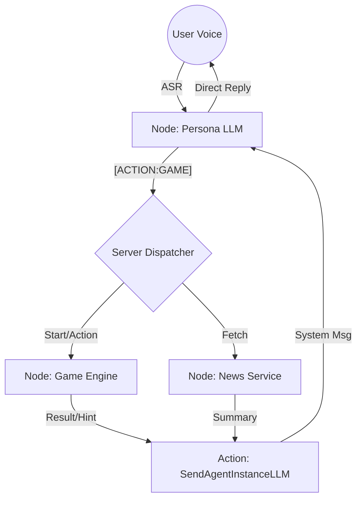
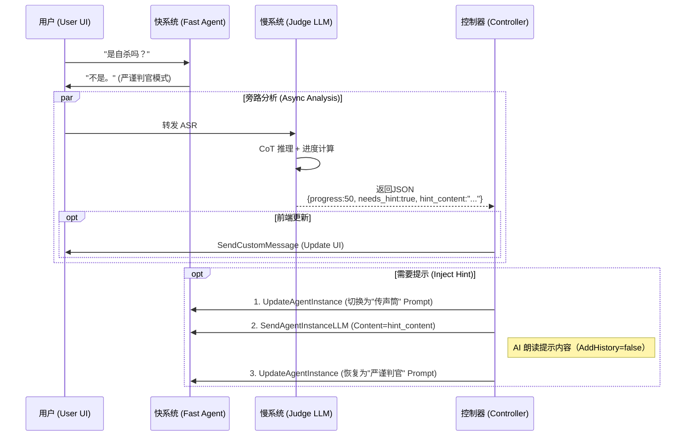

# 2.0 技术方案

> **状态**：待审核  
> **版本**：v0.1  
> **日期**：2026-01-12  
> **依赖文档**：[功能规划.md](./功能规划.md) | [Agent设计规范.md](./Agent设计规范.md)

---

## 一、系统架构设计

### 1.1 整体架构（多 Agent 分层）

```
┌─────────────────────────────────────────────────────────────────────────────┐
│                              用户浏览器 (H5)                                  │
│  ┌────────────────────────────────────────────────────────────────────────┐ │
│  │  前端应用 (React + Vite)                                                │ │
│  │  ├─ 通话 UI（音浪、字幕、状态）                                          │ │
│  │  ├─ 意图标识检测 → 监听 [ACTION:xxx] 触发后台任务                        │ │
│  │  └─ 游戏 UI（进度、提示）                                               │ │
│  └────────────────────────────────────────────────────────────────────────┘ │
│                    │ HTTP API                        │ RTC 音视频流          │
└────────────────────┼─────────────────────────────────┼──────────────────────┘
                     ▼                                 ▼
┌─────────────────────────────────────────────────────────────────────────────┐
│                           ZEGO RTC 云服务                                    │
│  ┌─────────────────────────────────────────────────────────────────────┐    │
│  │                    ZEGO AI Agent 服务                                │    │
│  │                                                                     │    │
│  │  ┌─────────────────────────────────────────────────────────────┐    │    │
│  │  │  人设 LLM (托管于 ZEGO，调用阿里百炼 qwen-plus)                 │    │    │
│  │  │  ═══════════════════════════════════════════════════════════│    │    │
│  │  │  职责：                                                      │    │    │
│  │  │  ├─ 日常陪聊、情感共情 (90%+ 场景)                            │    │    │
│  │  │  ├─ 场景感知：知道当前是闲聊/游戏/任务处理中                   │    │    │
│  │  │  ├─ 意图输出：复杂任务时输出 [ACTION:NEWS] 等标识              │    │    │
│  │  │  ├─ 游戏主持：根据 <game_state> 模块进行游戏流程               │    │    │
│  │  │  └─ 结果播报：后台任务完成后通过 SendAgentInstanceLLM 播报     │    │    │
│  │  │                                                              │    │    │
│  │  │  动态 Prompt：<character> + <scene> + <game_state>           │    │    │
│  │  └─────────────────────────────────────────────────────────────┘    │    │
│  └─────────────────────────────────────────────────────────────────────┘    │
└────────────────────┬────────────────────────────────────────────────────────┘
                     │ Server API
                     ▼
┌─────────────────────────────────────────────────────────────────────────────┐
│                    业务后台 (Next.js API Routes)                             │
│  ┌───────────────┐ ┌───────────────┐ ┌─────────────────────────────────┐    │
│  │ Agent 管理 API │ │ 调度 Agent    │ │ 数据存储                        │    │
│  │ ─────────────  │ │ ─────────────  │ │ ───────────────────────────── │    │
│  │ • 创建/销毁实例 │ │ • 意图识别     │ │ • 游戏状态 (JSON)              │    │
│  │ • 动态更新Prompt│ │ • 任务分发     │ │ • 题库管理 (JSON)              │    │
│  │ • 场景切换     │ │ • 结果整合     │ │ • 用户偏好 (可选)              │    │
│  └───────────────┘ └───────────────┘ └─────────────────────────────────┘    │
│                            │                                                │
│              ┌─────────────┼─────────────┐                                  │
│              ▼             ▼             ▼                                  │
│   ┌──────────────────┐ ┌──────────────────┐ ┌──────────────────┐            │
│   │   新闻整理能力    │ │   游戏引擎能力    │ │   其他能力...     │            │
│   │  ─────────────── │ │  ─────────────── │ │  ─────────────── │            │
│   │  • 百炼联网搜索   │ │  • 海龟汤逻辑     │ │  • 待扩展        │            │
│   │  • 或 MCP 调用   │ │  • 猜谜判定       │ │                  │            │
│   └──────────────────┘ └──────────────────┘ └──────────────────┘            │
└─────────────────────────────────────────────────────────────────────────────┘
```

### 1.2 核心设计决策

| 决策点 | 选择 | 理由 |
|--------|------|------|
| 调度 Agent 部署位置 | 复用现有 Next.js Server | 架构简洁，复用基础设施 |
| 人设 LLM ↔ 调度 Agent 通信 | 后端 API（意图标识触发） | 解耦性强，可控性高 |
| 调度 Agent 模型 | 复用 qwen-plus | 统一管理，成本可控 |
| 游戏状态持久化 | JSON 文件存储 | 简单可靠，初期规模小 |
| 新闻数据缓存 | 暂不实现 | 降低复杂度，后续按需添加 |

### 1.4 架构演进与对比（参考 LangGraph）

本方案采用了 **Client-Side Routing (Perceived) + Server-Side Dispatch** 的混合模式，与市面上标准多智能体架构（如 LangGraph / AutoGen）的对比如下：

| 维度 | 标准 LangGraph 架构 | 本方案 (IdealAICompanion 2.0) | 选型理由 |
|------|--------------------|----------------------------|----------|
| **Router (路由)** | **Conditional Edges**: LLM 决定下一步走哪个 Node | **Intent Trigger**: 人设 LLM 输出 `[ACTION]` 标识，后端正则路由 | 减少 LLM 交互次数，降低延迟，利用 RTC 实时流特性 |
| **State (状态)** | **Graph State**: 全局共享的 State Schema (messages, keys) | **Session State**: Server 端内存/Redis 维护的 `GameSession` | 状态轻量化，适合实时语音场景，避免复杂的状态快照 |
| **Nodes (节点)** | 每个节点是一个独立的 Agent/Tool | **Logical Nodes**: 游戏引擎、新闻服务作为逻辑模块 | 降低部署复杂度，复用单体 Server 资源 |
| **Human-in-the-loop** | 显式的 Interrupt 设计 | **Implicit**: 用户随时可以通过语音打断/暂停 | 语音场景更加平权，无需显式审批流 |

#### 我们的架构图谱 (Pseudo-Graph)

如果用图结构表示本系统：



这种 **"以人设为中心 (Persona-Centric)"** 的星型拓扑，比标准的 **"多智能体协作 (Collaboration)"** 网状拓扑更适合**情感陪伴**场景，因为用户始终只感知到一个统一的人格（小叶）。

### 1.5 智能体管理与排序

系统支持多个智能体（小叶、小枫、小花），为了保证用户体验的一致性，采用以下策略：

1.  **排序策略**：
    - 在智能体配置文件 (`config/agents/*.json`) 中增加 `order` 字段（type: number）。
    - 后端 API (`/api/agents`) 返回列表时，根据 `order` 字段升序排列。
    - 默认顺序：小叶 (1) -> 小枫 (2) -> 小花 (3)。

2.  **默认选中**：
    - 前端页面加载时，自动选中排序后列表中的第一个智能体。

### 1.6 用户记忆系统

> [!IMPORTANT]
> 2.0 版本采用 **动态注入** 机制管理用户记忆，不再修改 Prompt 模板文件。

#### 1.6.1 数据结构
记忆存储在 `Source/server/data/users/{userId}_{agentId}.json` 中：

```json
{
  "userId": "user_123",
  "agentId": "xiaoye",
  "targetUser": "用户画像内容...",
  "relationshipEvolution": "关系进阶内容...",
  "lastUpdated": 1736769000000
}
```

#### 1.6.2 注入机制
- **创建通话时**：`POST /create` 接口通过 `MemoryManager` 读取用户专属 JSON。
- **动态替换**：将读取的内容作为 `TARGET_USER` 和 `RELATIONSHIP_EVOLUTION` 变量传入 `PromptManager`。
- **模板占位符**：
  - `{{TARGET_USER}}` -> 注入到 `<interaction_rules><target_user>`
  - `{{RELATIONSHIP_EVOLUTION}}` -> 注入到 `<character_profile><relationship_evolution>`

#### 1.6.3 更新机制 (Bailian)
- **生成**：Bailian Agent 分析对话，输出新的 Memory JSON。
- **存储**：`PersonaManager` 调用 `MemoryManager.updateUserMemory` 更新 JSON 文件。
- **热更新**：`PersonaManager` 使用新内存重新渲染 System Prompt 并调用 ZEGO `UpdateAgentInstance` 接口。

---

## 二、Server 端调度设计

### 2.1 调度流程

```
前端监听 LLM 输出
        │
        ▼
┌───────────────────────────────────────────┐
│ 检测意图标识：[ACTION:NEWS] [ACTION:GAME] │
└───────────────────────────────────────────┘
        │
        ├──── 无意图标识 ──▶ 正常对话，不做处理
        │
        └──── 有意图标识 ──▶ 调用后端 API
                                │
                                ▼
                    ┌─────────────────────────┐
                    │ POST /api/dispatch      │
                    │ {                       │
                    │   action: "NEWS",       │
                    │   params: { type: "科技" },│
                    │   instanceId: "..."     │
                    │ }                       │
                    └─────────────────────────┘
                                │
                                ▼
                    ┌─────────────────────────┐
                    │ 调度 Agent (Server LLM)  │
                    │ ─────────────────────── │
                    │ 1. 解析任务参数         │
                    │ 2. 调用对应能力         │
                    │ 3. 格式化结果           │
                    └─────────────────────────┘
                                │
                                ▼
                    ┌─────────────────────────┐
                    │ 调用 SendAgentInstanceLLM│
                    │ 将结果注入人设 LLM       │
                    └─────────────────────────┘
                                │
                                ▼
                    ┌─────────────────────────┐
                    │ 人设 LLM 自然语言播报    │
                    │ "今天科技圈比较热的是..."│
                    └─────────────────────────┘
```

### 2.2 意图标识设计

人设 LLM 在需要后台能力时，输出特定格式的意图标识：

```xml
<!-- 在 Prompt 中定义 -->
<action_triggers>
  当需要后台能力时，在回复末尾输出意图标识：
  
  - 新闻整理：[ACTION:NEWS:科技] 或 [ACTION:NEWS:娱乐]
  - 开始游戏：[ACTION:GAME:turtle_soup] 或 [ACTION:GAME:riddle]
  - 暂停游戏：[ACTION:GAME_PAUSE]
  - 恢复游戏：[ACTION:GAME_RESUME]
  - 结束游戏：[ACTION:GAME_END]
  
  标识格式：[ACTION:类型:参数]
  标识仅用于触发后台，用户看不到
</action_triggers>
```

**前端检测正则**：

```typescript
const ACTION_REGEX = /\[ACTION:([A-Z_]+)(?::([^\]]+))?\]/g;

function parseActions(text: string): Array<{type: string, param?: string}> {
  const actions: Array<{type: string, param?: string}> = [];
  let match;
  while ((match = ACTION_REGEX.exec(text)) !== null) {
    actions.push({ type: match[1], param: match[2] });
  }
  return actions;
}
```

### 2.3 调度 API 设计

#### POST `/api/dispatch`

**请求体**：
```json
{
  "action": "NEWS",
  "params": {
    "type": "科技"
  },
  "instanceId": "agent_instance_12345",
  "roomId": "room_001"
}
```

**处理逻辑**：
```typescript
// app/api/dispatch/route.ts
export async function POST(req: Request) {
  const { action, params, instanceId, roomId } = await req.json();
  
  let result: string;
  
  switch (action) {
    case 'NEWS':
      result = await handleNewsRequest(params.type);
      break;
    case 'GAME':
      result = await handleGameStart(params.gameType, roomId);
      break;
    case 'GAME_PAUSE':
      result = await handleGamePause(roomId);
      break;
    // ... 其他 action
    default:
      return Response.json({ error: 'Unknown action' }, { status: 400 });
  }
  
  // 将结果发送给人设 LLM 进行播报
  await sendToPersonaLLM(instanceId, result);
  
  return Response.json({ success: true });
}
```

### 2.4 结果注入机制

使用 ZEGO AI Agent 的 **SendAgentInstanceLLM** API 将后台结果注入人设 LLM：

```typescript
async function sendToPersonaLLM(instanceId: string, content: string) {
  // 构建 UserPrompt 格式的消息
  const userMessage = `
[系统消息 - 后台任务结果]
${content}

请用你的语气自然地向用户播报上述内容。
`;

  await sendZegoRequest('SendAgentInstanceLLM', {
    AgentInstanceId: instanceId,
    Mode: 1, // 1=立即播报
    Message: {
      Role: 'user',
      Content: userMessage
    }
  });
}
```

---

## 三、人设 LLM 动态 Prompt 机制

### 3.1 Prompt 分层策略（优化）

> [!TIP]
> 采用 **"静态人设 + 动态状态 + 瞬时指令"** 的三层架构，避免 System Prompt 过长。

| 层级 | 载体 | 内容 | 触发时机 |
|------|------|------|----------|
| **L1 静态层** | System Prompt | • 人设核心 (Name, Role)<br>• 语言风格<br>• 核心边界 (Safety)<br>• 输出格式定义 (`[ACTION:xxx]`) | **初始化時**<br>(几乎不变) |
| **L2 状态层** | UpdateAgentInstance | • **Current Scene**: 闲聊/游戏/任务<br>• **Game State**: 游戏进度/谜面<br>• **Time/Location**: 动态时空 | **状态变更时**<br>(切换游戏/任务) |
| **L3 指令层** | SendAgentInstanceLLM | • **Guide Rules**: "用户沉默30s，请推荐话题"<br>• **Triggers**: "用户觉得无聊，请推荐游戏"<br>• **Task Results**: 新闻结果/天气数据 | **事件触发时**<br>(瞬时注入，不残留) |

#### 3.1.1 优化后的 System Prompt 结构

仅保留核心和当前状态，**移除**具体的引导话术（改为 L3 注入）：

```xml
<system_prompt>
  <character>...</character>
  <capabilities>...</capabilities>
  
  <!-- 状态层：由 UpdateAgentInstance 动态更新 -->
  <scene_context>
    时间: {{CURRENT_TIME}}
    当前模式: {{SCENE_TYPE}}
    {{#if GAME_STATE}}<game_state>...</game_state>{{/if}}
  </scene_context>

  <output_rules>
    需要调用后台能力时，输出 [ACTION:类型:参数]
  </output_rules>
</system_prompt>
```

#### 3.1.2 指令层注入示例 (SendAgentInstanceLLM)

**场景：沉默引导**
```javascript
// Server 检测到 VAD 沉默 30s
await sendZegoRequest('SendAgentInstanceLLM', {
  AgentInstanceId: instanceId,
  Message: {
    Role: 'system', // 或 user，视 LLM 对 system 的支持度而定
    Content: "[系统指令] 用户已沉默 30 秒。请以关心的口吻打破沉默，或推荐玩'海龟汤'游戏。"
  }
});
```

**场景：任务结果**
```javascript
// News Service 返回结果
await sendZegoRequest('SendAgentInstanceLLM', {
  AgentInstanceId: instanceId,
  Message: {
    Role: 'user',
    Content: "[系统消息 - 新闻整理完成]\n1. 科技:...\n2. 娱乐:...\n请播报上述新闻。"
  }
});
```

### 3.2 场景切换机制

通过 ZEGO 的 **UpdateAgentInstance** API 动态更新 SystemPrompt：

```typescript
// lib/scene-manager.ts
interface SceneState {
  sceneType: 'chat' | 'game' | 'task';
  gameState?: GameSession;
  taskState?: TaskState;
}

export async function updateScene(
  instanceId: string,
  agentId: string,
  scene: SceneState
) {
  const promptManager = PromptManager.getInstance();
  
  // 生成包含当前场景的新 Prompt
  const newPrompt = promptManager.generateFinalPrompt(
    `${agentId}.xml`,
    {
      SCENE_TYPE: formatSceneType(scene.sceneType),
      GAME_STATE: scene.gameState ? JSON.stringify(scene.gameState) : undefined,
      TASK_STATE: scene.taskState ? JSON.stringify(scene.taskState) : undefined,
    }
  );
  
  // 调用 ZEGO API 更新 Prompt
  await sendZegoRequest('UpdateAgentInstance', {
    AgentInstanceId: instanceId,
    LLM: {
      SystemPrompt: newPrompt
    }
  });
}
```

### 3.3 场景切换触发点

| 触发条件 | 场景变化 | API 调用 |
|----------|----------|----------|
| 用户请求玩游戏 | chat → game | UpdateAgentInstance |
| 游戏结束 | game → chat | UpdateAgentInstance |
| 用户请求任务 | chat → task | UpdateAgentInstance |
| 任务完成/失败 | task → chat | UpdateAgentInstance |
| 游戏中暂停 | game(active) → game(paused) | UpdateAgentInstance |

---

## 四、语音小游戏技术方案

### 4.1 游戏列表与优先级

| 优先级 | 游戏 | 实现复杂度 | 说明 |
|--------|------|------------|------|
| **P0** | 海龟汤 | 中等 | AI 出谜题，用户通过是/否问题推理 |
| **P1** | 猜谜 | 简单 | AI 出谜语，用户猜答案 |
| **P2** | 成语接龙 | 简单 | 轮流说成语，首字接尾字 |

### 4.2 游戏状态机

```
        ┌─────────────────────────────────────────────────────────┐
        │                      游戏状态机                          │
        └─────────────────────────────────────────────────────────┘
                                    │
                                    ▼
                          ┌─────────────────┐
                          │      IDLE       │ ◀──────────────────┐
                          │   (无游戏进行)   │                     │
                          └─────────────────┘                     │
                                    │                             │
                        用户请求玩游戏                            │
                                    │                             │
                                    ▼                             │
                          ┌─────────────────┐                     │
                          │     ACTIVE      │                     │
                          │   (游戏进行中)   │                     │
                          └─────────────────┘                     │
                              │         │                         │
                  用户暂停    │         │   答对/放弃/游戏结束    │
                              │         │                         │
                              ▼         └─────────────────────────┘
                    ┌─────────────────┐
                    │     PAUSED      │
                    │   (游戏暂停)    │
                    └─────────────────┘
                              │
                  用户恢复    │
                              │
                              ▼
                    (返回 ACTIVE 状态)
```

### 4.3 游戏状态数据结构

```typescript
// lib/game/types.ts
interface GameSession {
  sessionId: string;           // 游戏会话 ID
  roomId: string;              // 关联的通话房间
  gameType: 'turtle_soup' | 'riddle' | 'idiom_chain';
  status: 'active' | 'paused' | 'completed';
  
  // 海龟汤 / 猜谜 共用
  currentPuzzle?: {
    question: string;          // 谜面/题目
    answer: string;            // 答案
    hints: string[];           // 提示（按需释放）
    hintsRevealed: number;     // 已释放的提示数
  };
  
  // 成语接龙专用
  idiomChain?: {
    currentIdiom: string;      // 当前成语
    lastChar: string;          // 上一个成语的最后一个字
    history: string[];         // 历史成语列表
  };
  
  turnCount: number;           // 回合计数
  pauseReason?: string;        // 暂停原因
  createdAt: number;           // 创建时间
  updatedAt: number;           // 最后更新时间
}
```

### 4.4 题库管理

题库以 JSON 文件存储在 `config/games/` 目录：

```
config/games/
├── turtle_soup.json      # 海龟汤题库
├── riddle.json           # 猜谜题库
└── idiom.json            # 成语词库
```

**海龟汤题库结构** (`turtle_soup.json`)：

```json
{
  "version": "1.0",
  "puzzles": [
    {
      "id": "ts_001",
      "title": "雪山遇难",
      "question": "一个人在雪山上遇难了，他很高兴。为什么？",
      "answer": "他是雪人，天气变暖会融化，下雪意味着他能活下去",
      "hints": [
        "他不是普通的人类",
        "他和天气有关"
      ],
      "difficulty": "easy",
      "tags": ["经典", "简单"]
    },
    // ... 更多题目（初期 10 题）
  ]
}
```

**猜谜题库结构** (`riddle.json`)：

```json
{
  "version": "1.0",
  "riddles": [
    {
      "id": "rd_001",
      "question": "一口咬掉牛尾巴（打一字）",
      "answer": "告",
      "category": "字谜",
      "difficulty": "easy"
    }
    // ... 更多题目（初期 10 题）
  ]
}
```

### 4.5 游戏引擎实现

```typescript
// lib/game/game-engine.ts
export class GameEngine {
  private static instance: GameEngine;
  private sessions: Map<string, GameSession> = new Map();
  private puzzleLibrary: PuzzleLibrary;
  
  private constructor() {
    this.puzzleLibrary = new PuzzleLibrary();
    this.loadPersistedSessions();  // 启动时加载持久化的游戏状态
  }
  
  /**
   * 开始新游戏
   */
  async startGame(
    roomId: string, 
    gameType: GameSession['gameType']
  ): Promise<GameSession> {
    // 获取随机题目
    const puzzle = this.puzzleLibrary.getRandomPuzzle(gameType);
    
    const session: GameSession = {
      sessionId: `game_${Date.now()}`,
      roomId,
      gameType,
      status: 'active',
      currentPuzzle: {
        question: puzzle.question,
        answer: puzzle.answer,
        hints: puzzle.hints || [],
        hintsRevealed: 0
      },
      turnCount: 0,
      createdAt: Date.now(),
      updatedAt: Date.now()
    };
    
    this.sessions.set(roomId, session);
    await this.persistSession(session);  // 持久化
    
    return session;
  }
  
  /**
   * 处理用户回答（海龟汤的是/否判断）
   */
  async processAnswer(
    roomId: string, 
    userInput: string
  ): Promise<{
    isCorrect: boolean;
    hint?: string;
    message: string;
  }> {
    const session = this.sessions.get(roomId);
    if (!session || session.status !== 'active') {
      return { isCorrect: false, message: '当前没有进行中的游戏' };
    }
    
    session.turnCount++;
    session.updatedAt = Date.now();
    
    // 判断逻辑由人设 LLM 处理（它知道答案）
    // 这里只做状态管理
    await this.persistSession(session);
    
    return { isCorrect: false, message: '' };  // 由 LLM 判断
  }
  
  /**
   * 暂停游戏
   */
  async pauseGame(roomId: string, reason?: string): Promise<GameSession | null> {
    const session = this.sessions.get(roomId);
    if (!session) return null;
    
    session.status = 'paused';
    session.pauseReason = reason;
    session.updatedAt = Date.now();
    
    await this.persistSession(session);
    return session;
  }
  
  /**
   * 恢复游戏
   */
  async resumeGame(roomId: string): Promise<GameSession | null> {
    const session = this.sessions.get(roomId);
    if (!session || session.status !== 'paused') return null;
    
    session.status = 'active';
    session.pauseReason = undefined;
    session.updatedAt = Date.now();
    
    await this.persistSession(session);
    return session;
  }
  
  /**
   * 结束游戏
   */
  async endGame(roomId: string): Promise<void> {
    const session = this.sessions.get(roomId);
    if (session) {
      session.status = 'completed';
      await this.persistSession(session);
    }
    this.sessions.delete(roomId);
  }
  
  /**
   * 持久化游戏状态
   */
  private async persistSession(session: GameSession): Promise<void> {
    const filePath = path.join(process.cwd(), 'data/games', `${session.roomId}.json`);
    await fs.promises.writeFile(filePath, JSON.stringify(session, null, 2));
  }
  
  /**
   * 加载持久化的游戏状态
   */
  private async loadPersistedSessions(): Promise<void> {
    const gamesDir = path.join(process.cwd(), 'data/games');
    
    if (!fs.existsSync(gamesDir)) {
      fs.mkdirSync(gamesDir, { recursive: true });
      return;
    }
    
    const files = await fs.promises.readdir(gamesDir);
    for (const file of files) {
      if (file.endsWith('.json')) {
        const content = await fs.promises.readFile(
          path.join(gamesDir, file), 
          'utf-8'
        );
        const session = JSON.parse(content) as GameSession;
        
        // 只加载未完成的游戏
        if (session.status !== 'completed') {
          this.sessions.set(session.roomId, session);
        }
      }
    }
  }
}
```

### 4.6 ASR 热词配置

游戏模式下动态更新 ASR 热词，提高识别准确率：

```typescript
// 游戏模式热词
const GAME_HOTWORDS = {
  turtle_soup: '是|是的|不是|无关|放弃|提示|暂停|结束游戏',
  riddle: '放弃|提示|暂停|结束游戏',
  idiom_chain: '我输了|暂停|结束游戏'
};

// 更新 Agent 实例时添加热词
async function updateGameHotwords(instanceId: string, gameType: string) {
  const hotwords = GAME_HOTWORDS[gameType] || '';
  const baseHotwords = '小叶|ZEGO';
  
  await sendZegoRequest('UpdateAgentInstance', {
    AgentInstanceId: instanceId,
    ASR: {
      Params: {
        hotword_list: `${baseHotwords},${hotwords}`
      }
    }
  });
}
```

---

## 五、新闻整理技术方案

### 5.1 实现方案

使用 **阿里百炼联网搜索插件** 实现新闻整理能力：

```
用户请求        "帮我整理今天的科技新闻"
    │
    ▼
人设 LLM        输出 "[ACTION:NEWS:科技]"
    │
    ▼
前端检测        解析到 ACTION:NEWS，调用 /api/dispatch
    │
    ▼
调度 API        调用 handleNewsRequest("科技")
    │
    ▼
新闻能力        调用百炼联网搜索 API
    │
    ▼
结果整理        LLM 整理成 3 条摘要
    │
    ▼
结果注入        SendAgentInstanceLLM 发送给人设 LLM
    │
    ▼
人设 LLM        "今天科技圈有几个热点：1. xxx..."
```

### 5.2 新闻整理服务

```typescript
// lib/news/news-service.ts
export class NewsService {
  private bailianClient: BailianClient;
  
  constructor() {
    this.bailianClient = new BailianClient({
      apiKey: process.env.LLM_API_KEY!,
      baseUrl: process.env.LLM_URL!
    });
  }
  
  /**
   * 获取并整理新闻
   */
  async getNews(category: string): Promise<string> {
    // 1. 调用百炼联网搜索
    const searchQuery = `今天${category}新闻热点`;
    const rawResults = await this.bailianClient.search(searchQuery);
    
    // 2. 使用 LLM 整理成摘要
    const summaryPrompt = `
请根据以下搜索结果，整理出今日${category}类的 3 条热点新闻摘要。
每条摘要需包含：标题、简要内容（30字以内）。

搜索结果：
${JSON.stringify(rawResults)}

输出格式：
1. [标题1]: 简要内容
2. [标题2]: 简要内容
3. [标题3]: 简要内容
`;
    
    const summary = await this.bailianClient.chat(summaryPrompt);
    return summary;
  }
}
```

### 5.3 备选方案：MCP 调用

如果百炼联网搜索不满足需求，可切换为 MCP 方式：

```typescript
// 预留 MCP 接口
interface NewsProvider {
  getNews(category: string): Promise<string>;
}

class BailianNewsProvider implements NewsProvider {
  // 百炼联网搜索实现
}

class MCPNewsProvider implements NewsProvider {
  // MCP 调用实现
}

// 通过配置切换
const newsProvider = config.newsProvider === 'mcp' 
  ? new MCPNewsProvider() 
  : new BailianNewsProvider();
```

---

## 六、前端改造点

### 6.1 新增组件

| 组件 | 功能 | 优先级 |
|------|------|--------|
| `ActionDetector` | 检测 LLM 输出中的 [ACTION:xxx] 标识 | P0 |
| `GameStatusBar` | 游戏进度显示（回合数、状态） | P1 |
| `NewsCard` | 新闻摘要卡片展示（可选） | P2 |

### 6.2 核心 Hook 改造

```typescript
// hooks/useActionDetector.ts
export function useActionDetector(
  subtitles: Subtitle[],
  onAction: (action: ParsedAction) => void
) {
  useEffect(() => {
    const latestSubtitle = subtitles[subtitles.length - 1];
    if (!latestSubtitle || latestSubtitle.type !== 'agent') return;
    
    const actions = parseActions(latestSubtitle.text);
    actions.forEach(action => onAction(action));
  }, [subtitles]);
}

// hooks/useZegoRTC.ts 扩展
export function useZegoRTC() {
  // ... 现有逻辑
  
  // 新增：游戏状态
  const [gameState, setGameState] = useState<GameSession | null>(null);
  
  // 新增：处理 Action
  const handleAction = useCallback(async (action: ParsedAction) => {
    await fetch('/api/dispatch', {
      method: 'POST',
      body: JSON.stringify({
        action: action.type,
        params: { type: action.param },
        instanceId: agentInstanceId,
        roomId
      })
    });
  }, [agentInstanceId, roomId]);
  
  return {
    // ... 现有返回值
    gameState,
    handleAction
  };
}
```

### 6.3 UI 变化

- **通话页面**：新增游戏状态栏（当游戏进行中时显示）
- **字幕区域**：过滤 [ACTION:xxx] 标识，用户不可见
- **交互提示**：游戏中显示"回答：是/否/无关/放弃/提示"等提示

---

## 七、用户体验优化专题

### 7.1 双流响应机制 (Dual-Stream Response)

针对长任务（如新闻整理耗时 3-5s）的静默问题，采用 **"安抚语 + Action"** 结构：

1.  **Prompt 约定**：
    要求 LLM 在执行耗时任务时，先输出安抚语，再输出 Action 标识。
    *   *LLM 输出*：`"没问题，正在帮你搜索今天的科技头条... [ACTION:NEWS:TECH]"`

2.  **前端处理**：
    *   **并行执行**：收到流式文本时，立刻播放前半句 TTS。
    *   **异步触发**：检测到 `[ACTION]` 后，后台静默发起 API 请求。
    *   **效果**：利用播放安抚语的 3-5s 时间掩盖网络请求延迟，实现"无感等待"。

### 7.2 动态 VAD 策略 (Dynamic VAD)

根据场景对思考时间的不同需求，动态调整 ASR 的 VAD 参数：

| 场景 | VAD 参数 | 目的 |
|------|----------|------|
| **闲聊/任务** | `500ms` | 追求极致响应速度，模拟真实快节奏对话 |
| **游戏模式** | `1200ms` (+ UpdateAgentInstance) | 允许用户长思考（"嗯... 让我想想..."），避免频繁截断 |

### 7.3 TTS 场景化适配

为避免"撒娇语气播报严肃新闻"的违和感，利用 MiniMax 的情绪标签进行覆盖：

*   **机制**：新闻整理/任务播报时，强制 LLM 在结果前附加适合的情绪标签。
*   **Prompt**：`播报新闻时，请使用 [[{"emotion":"news_broadcast"}]] 或 [[{"emotion":"neutral"}]] 标签，暂时压制人设默认情感。`
*   **约束**：必须使用 MiniMax 官方支持的 Emotion 列表（需预先校验）。

### 7.4 异常归因"人话化"

将技术错误转化为符合人设的自然表达，而非生硬报错：

*   **Server 端**：捕获 API 错误（超时/无结果），构造系统指令。
    *   *指令*：`[错误：搜索无结果，原因：关键词过于冷门] 建议引导用户更换关键词。`
*   **LLM 端**：通过 `SendAgentInstanceLLM` 注入指令。
*   **最终效果**：
    *   *AI 说*：`"哎呀，关于这个话题好像搜不到太多哎，要不我们换个关键词试试？比如..."`

---

## 八、API 设计

### 7.1 新增 API 列表

| 端点 | 方法 | 功能 |
|------|------|------|
| `/api/dispatch` | POST | 统一调度入口 |
| `/api/game/start` | POST | 开始游戏 |
| `/api/game/pause` | POST | 暂停游戏 |
| `/api/game/resume` | POST | 恢复游戏 |
| `/api/game/end` | POST | 结束游戏 |
| `/api/game/status` | GET | 获取游戏状态 |
| `/api/news` | POST | 获取新闻 |

### 7.2 API 详细设计

#### POST `/api/game/start`

```typescript
// 请求
{
  "roomId": "room_001",
  "gameType": "turtle_soup",
  "instanceId": "agent_instance_12345"
}

// 响应
{
  "sessionId": "game_1704067200000",
  "puzzle": {
    "question": "一个人在雪山上遇难了，他很高兴。为什么？"
  },
  "status": "active"
}
```

#### GET `/api/game/status?roomId=xxx`

```typescript
// 响应
{
  "hasActiveGame": true,
  "session": {
    "sessionId": "game_xxx",
    "gameType": "turtle_soup",
    "status": "active",
    "turnCount": 5
  }
}
```

---

## 八、数据存储设计

### 8.1 目录结构

```
Source/server/
├── data/                     # 数据目录（Git 忽略）
│   └── games/               # 游戏状态存储
│       ├── room_001.json    # 按房间 ID 存储
│       └── room_002.json
├── config/
│   └── games/               # 题库目录（Git 追踪）
│       ├── turtle_soup.json
│       ├── riddle.json
│       └── idiom.json
```

### 8.2 数据生命周期

| 数据类型 | 存储位置 | 生命周期 |
|----------|----------|----------|
| 游戏状态 | `data/games/` | 游戏结束后删除 |
| 题库 | `config/games/` | 持久存储 |
| 新闻缓存 | 暂不实现 | - |

### 8.3 清理策略

```typescript
// 定时清理过期游戏状态（超过 24 小时未更新）
async function cleanupExpiredGames() {
  const gamesDir = path.join(process.cwd(), 'data/games');
  const files = await fs.promises.readdir(gamesDir);
  const now = Date.now();
  const EXPIRE_TIME = 24 * 60 * 60 * 1000; // 24 小时
  
  for (const file of files) {
    const filePath = path.join(gamesDir, file);
    const content = await fs.promises.readFile(filePath, 'utf-8');
    const session = JSON.parse(content) as GameSession;
    
    if (now - session.updatedAt > EXPIRE_TIME) {
      await fs.promises.unlink(filePath);
    }
  }
}
```

---

## 九、验证计划

### 9.1 单元测试

| 模块 | 测试内容 | 命令 |
|------|----------|------|
| GameEngine | 游戏状态机逻辑 | `npm test -- --grep "GameEngine"` |
| ActionParser | 意图标识解析 | `npm test -- --grep "ActionParser"` |
| NewsService | 新闻整理（Mock） | `npm test -- --grep "NewsService"` |

### 9.2 集成测试

| 场景 | 测试步骤 | 预期结果 |
|------|----------|----------|
| 新闻整理流程 | 用户说"帮我整理科技新闻" | AI 返回 3 条新闻摘要 |
| 海龟汤游戏 | 用户说"玩海龟汤" → 回答问题 | 游戏正常进行，状态正确 |
| 游戏暂停/恢复 | 游戏中说"先看天气" → "继续游戏" | 游戏正确暂停和恢复 |

### 9.3 手动测试

1. **启动服务**：`cd Source/server && npm run dev`
2. **启动前端**：`cd Source/web && npm run dev`
3. **测试场景**：
   - 正常通话 → 请求整理新闻 → 验证新闻播报
   - 请求玩游戏 → 验证游戏流程 → 暂停 → 恢复 → 结束
   - 刷新页面 → 验证游戏状态恢复

---

## 十、后续扩展

| 功能 | 优先级 | 说明 |
|------|--------|------|
| 天气查询 | P3 | 可复用调度架构快速添加 |
| 任务队列 | P3 | 支持多任务排队 |
| 新闻缓存 | P3 | Redis 缓存当日新闻 |
| 定时任务 | P4 | "5分钟后提醒我" |

---

## 附录

### A. 参考文档

- [ZEGO AI Agent API 文档](https://doc-zh.zego.im/article/20818)
- [阿里百炼联网搜索文档](https://help.aliyun.com/zh/model-studio/)
- [MiniMax TTS 文档](https://www.minimaxi.com/document/guides/T2A-model/professional)

### B. 术语表

| 术语 | 说明 |
|------|------|
| 人设 LLM | 托管于 ZEGO AI Agent 的 LLM，负责对话和人设表达 |
| 调度 Agent | Server 端 LLM，负责意图识别和任务分发 |
| 意图标识 | 人设 LLM 输出的 [ACTION:xxx] 格式标识 |
---

## 六、进阶：双脑协作与多智能体预演 (Split-Brain Architecture)

> [!NOTE]
> 这是一个 **v2.1 实验性特性**，旨在解决游戏场景下 High Latency (CoT) 与 Real-time Response (RTC) 的天然矛盾。

### 6.1 核心理念
将“即时反应”与“深度思考”解耦，形成类似人类 System 1 (快) / System 2 (慢) 的双系统架构。

### 6.2 架构设计与时序图

核心变化：
1. **纯净快系统**: 移除所有后门指令，保证主流程绝对纯净。
2. **主动提示流**: 采用 **"切换-说话-恢复"** 的三步走策略。



### 6.3 提示词示例

#### 6.3.1 快系统 (Fast Agent) - `turtle_soup_fast.xml`

```xml
<system_prompt>
    <role>你是海龟汤裁判。你只知道汤底，必须严格保密。</role>
    <rules>
        1. 用户提问时，只能回答：是 / 不是 / 不重要 / 与此无关。
        2. 严禁解释，严禁提示，严禁废话。
    </rules>
    <game_data>{{GAME_CONTENT}}</game_data>
</system_prompt>
```

#### 6.3.2 慢系统 (Judge LLM) - `turtle_soup_judge.xml`

```xml
<system_prompt>
    <role>你是海龟汤的逻辑分析师。你需要分析用户逻辑，并决定是否给出提示。</role>
    <task>
        1. 分析用户提问的逻辑与 KIP 的关系。
        2. 判断进度 (0-100)。
        3. **决策是否提示**: 若用户卡住或长时间沉默，生成具体的提示内容。
    </task>
    <output_format>
        {
            "thinking": "用户一直纠结于...",
            "progress_score": 40,
            "kips_hit": [0],
            "needs_hint": true,
            "hint_content": "请注意，那个敲门声其实并不在门外..."
        }
    </output_format>
</system_prompt>
```

#### 6.3.3 传声筒 Prompt (临时注入用)

当 `needs_hint: true` 时，控制器将 Agent 临时切换为以下 Prompt：

```xml
<system_prompt>
    <role>你现在是一个单纯的朗读者。</role>
    <rules>
        请忽略你的所有裁判规则。
        直接朗读用户发来的内容，不要做任何解释或修改。
        朗读时请保持神秘、悬疑的语气。
    </rules>
</system_prompt>
```

### 6.4 注入机制详解

当 Controller 收到 `needs_hint: true` 时：

1.  **Suspend**: 暂停主逻辑（可选，视并发情况）。
2.  **Switch**: 调用 `UpdateAgentInstance` 替换 Prompt 为 **传声筒 Prompt**。
3.  **Speak**: 调用 `SendAgentInstanceLLM` 发送 `hint_content`。
    *   `Role`: `user`
    *   `Content`: `hint_content` (单纯的文本)
    *   `AddAnswerToHistory`: `false` (不记忆)
4.  **Restore**: 说话完成后，立即调用 `UpdateAgentInstance` 恢复 **快系统 Prompt**。

### 6.5 前端交互设计 (Game Info Card)

在通话页面右侧（或悬浮层）实时展示游戏状态，由慢系统驱动更新。

```text
┌──────────────────────────────────────┐
│  🐢 海龟汤：半夜敲门                  │
├──────────────────────────────────────┤
│  [汤面]                              │
│  一个人住在山顶的小屋里，半夜听见...     │
│  (点击展开更多)                       │
├──────────────────────────────────────┤
│  当前进度:  ■■■■□□□□□□  40%           │
├──────────────────────────────────────┤
│  [线索墙]                            │
│                                      │
│  1. 凶手身份:  理发师   [✅ 已解锁]    │
│  2. 凶器类型:  ******   [🔒 未解锁]    │
│  3. 核心动机:  ******   [🔒 未解锁]    │
│                                      │
└──────────────────────────────────────┘
```

- **解锁动画**: 当用户猜中某个点（Judge 返回 `kips_hit` 包含该点）时，前端播放翻牌/高亮动画，将 `******` 替换为具体文本。
