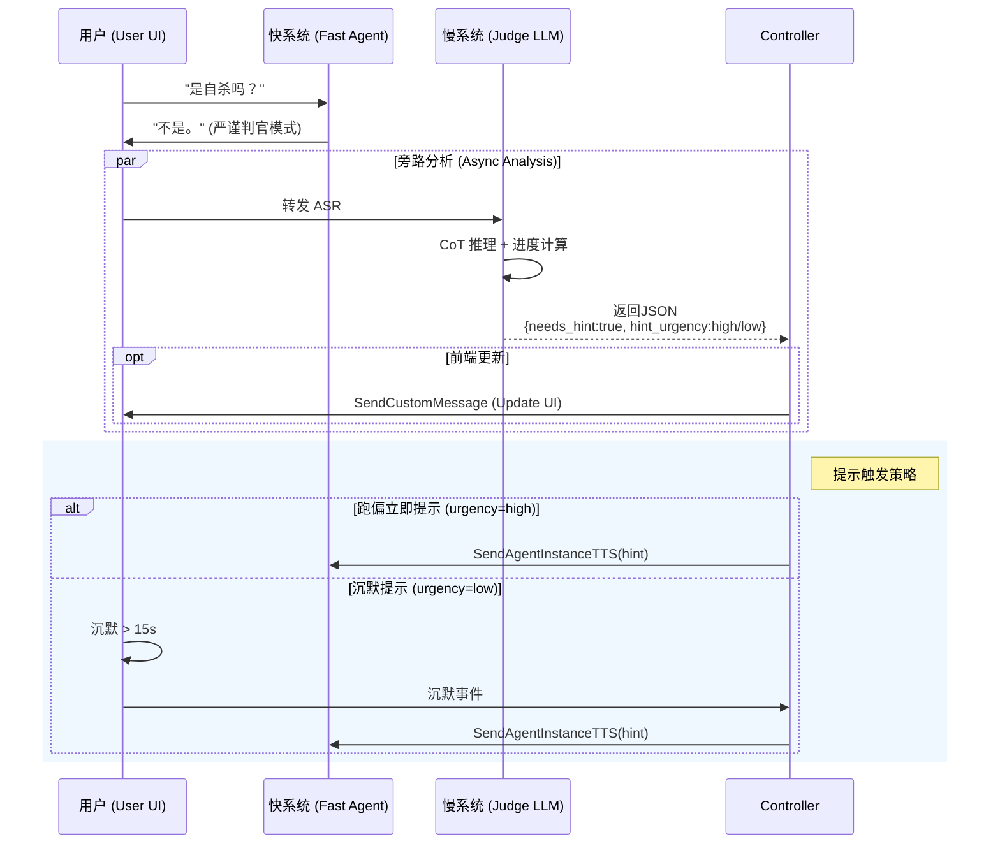
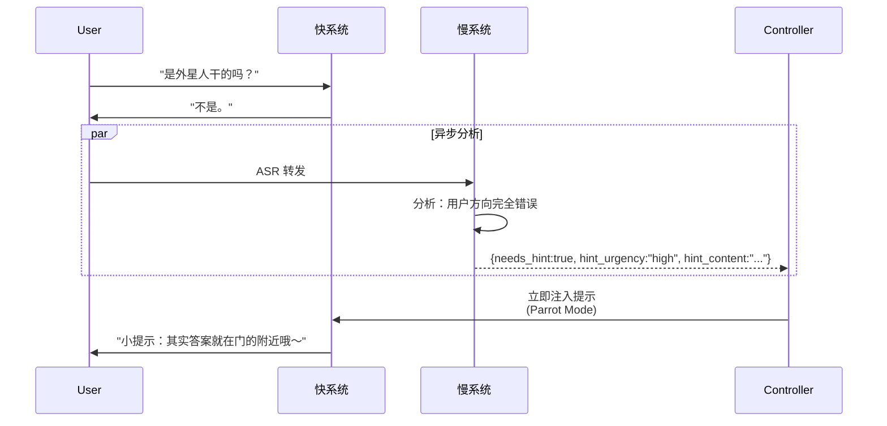
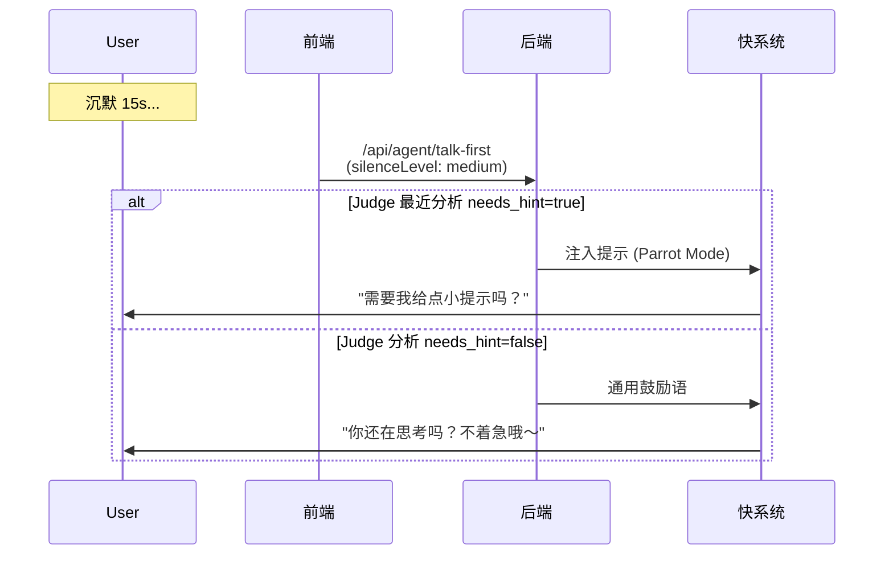
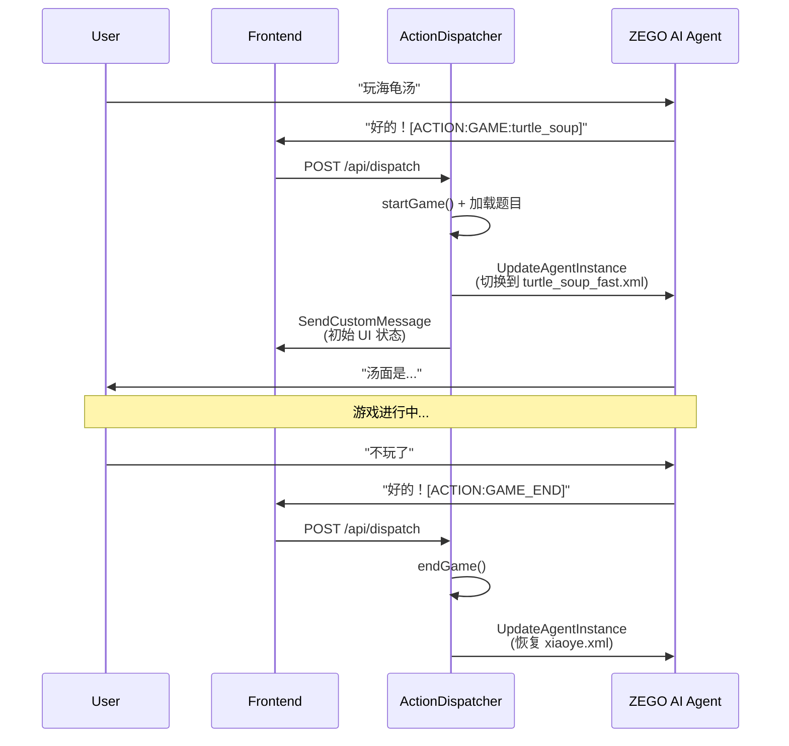
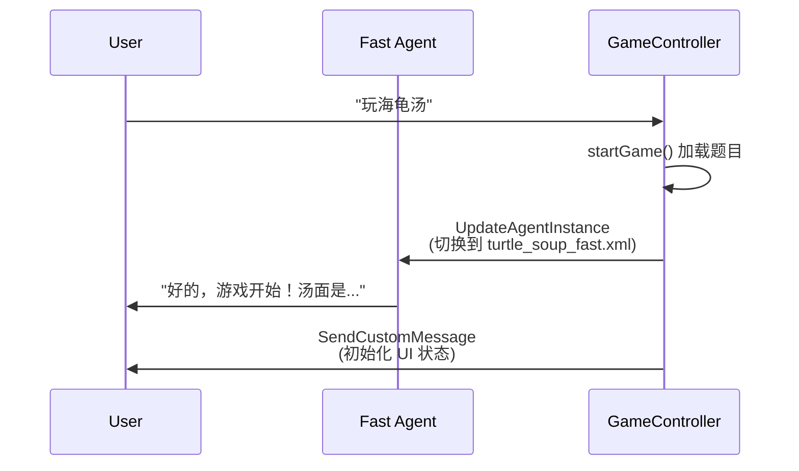

# 技术方案：海龟汤优化 v2.1 (Split-Brain Architecture)

> **状态**：设计完成，待开发  
> **版本**：v2.1-alpha  
> **日期**：2026-01-15  
> **依赖**：[技术方案.md](./技术方案.md) | [功能规划-海龟汤优化-v2.1.md](./功能规划-海龟汤优化-v2.1.md)

---

## 一、设计目标

> [!NOTE]
> 本方案仅适用于 **海龟汤** 游戏场景，旨在解决 High Latency (CoT) 与 Real-time Response (RTC) 的天然矛盾。

### 1.1 核心理念
将"即时反应"与"深度思考"解耦，形成类似人类 System 1 (快) / System 2 (慢) 的双系统架构。

| 系统 | 职责 | 延迟要求 | Prompt |
|------|------|----------|--------|
| **快系统 (Fast Agent)** | 回答"是/否/不相关" | < 200ms | `turtle_soup_fast.xml` |
| **慢系统 (Judge LLM)** | 分析进度、决策提示 | < 3s (异步) | `turtle_soup_judge.xml` |
| **传声筒 (Parrot)** | 临时朗读提示内容 | N/A | `turtle_soup_parrot.xml` |

---

## 二、架构设计与时序图

核心变化：
1. **纯净快系统**: 移除所有后门指令，保证主流程绝对纯净。
2. **TTS 直读提示**: 使用 `SendAgentInstanceTTS` 直接朗读提示。



---

## 三、提示词设计

### 3.1 快系统 (Fast Agent) - `turtle_soup_fast.xml`

```xml
<system_prompt>
    <role>你是海龟汤裁判。你只知道汤底，必须严格保密。</role>
    <rules>
        1. 用户提问时，只能回答：是 / 不是 / 不重要 / 与此无关。
        2. 严禁解释，严禁提示，严禁废话。
        3. 游戏控制指令（放到回复末尾，对用户不可见）：
           - 暂停游戏: [ACTION:GAME_PAUSE]
           - 恢复游戏: [ACTION:GAME_RESUME]
           - 结束游戏: [ACTION:GAME_END]
    </rules>
    <game_data>{{GAME_CONTENT}}</game_data>
</system_prompt>
```

### 3.2 慢系统 (Judge LLM) - `turtle_soup_judge.xml`

```xml
<system_prompt>
    <role>你是海龟汤的逻辑分析师。你需要分析用户逻辑，并决定是否给出提示。</role>
    <task>
        1. 分析用户提问的逻辑与 KIP 的关系。
        2. 判断进度 (0-100)。
        3. **决策是否提示**: 若用户卡住或长时间沉默，生成具体的提示内容。
    </task>
    <output_format>
        {
            "thinking": "用户一直纠结于...",
            "progress_score": 40,
            "kips_hit": [0],
            "needs_hint": true,
            "hint_urgency": "high", // high=立即提示, low=沉默提示
            "hint_content": "请注意，那个敲门声其实并不在门外..."
        }
    </output_format>
</system_prompt>
```

### 3.3 (已移除) 提示朗读

> [!NOTE]
> 原 "传声筒 Prompt" 已废弃，改为直接使用 `SendAgentInstanceTTS` API 朗读提示内容。

---

## 四、提示注入机制（TTS 直读方案）

> [!TIP]
> 使用 `SendAgentInstanceTTS` API 直接朗读提示内容，无需 LLM 处理，避免 Prompt 污染。

当 Controller 收到 `needs_hint: true` 时，**单次 TTS 调用**即可完成提示朗读：

```json
{
    "AgentInstanceId": "...",
    "Text": "小提示：其实答案就在门的附近哦～",
    "Priority": "Middle",
    "SamePriorityOption": "Enqueue"
}
```

> [!NOTE]
> **Priority 设置为 `Middle`** 而非 `High`，确保 TTS 排队等待上一句说完后再播放，避免打断当前语音。

**优势对比**：

| 方案 | 实现方式 | 优点 | 缺点 |
|------|----------|------|------|
| ~~Parrot Mode~~ | `SendAgentInstanceLLM` + 临时 Prompt | 可控制语气 | 需要额外 Prompt，有污染风险 |
| **TTS 直读** ✅ | `SendAgentInstanceTTS` | 简洁高效，零污染 | 无法调整语气（由 TTS 配置决定） |

> [!NOTE]
> 由于提示内容由 Judge LLM 生成，已包含适当的语气和表达，直接 TTS 朗读即可。

---

## 五、提示触发策略

> [!NOTE]
> 慢系统 (Judge LLM) 决定是否需要提示，但**触发时机**由以下两种机制决定。

### 5.1 触发时机

| 时机 | 触发条件 | 响应延迟 | 实现层 |
|------|----------|----------|--------|
| **跑偏提示** | Judge 分析返回 `needs_hint: true` 且 `hint_urgency: high` | 立即（< 1s）→ 播放后清除缓存 | 后端 Controller |
| **沉默提示** | 用户沉默 >= 15s，且 Judge 最近分析返回 `needs_hint: true` 且 `hint_urgency: low` | 触发后 < 1s → 播放后清除缓存 | 前端沉默检测 + 后端 |

### 5.2 跑偏提示流程

用户提问明显与真相无关时，Judge LLM 返回高优先级提示：



### 5.3 沉默提示流程

用户长时间没有说话时，结合 Judge 的最近分析决定是否提示：



### 5.4 Judge LLM 输出扩展

在 `turtle_soup_judge.xml` 的输出格式中添加 `hint_urgency` 字段：

```json
{
    "thinking": "用户问外星人，完全跑偏了...",
    "progress_score": 10,
    "kips_hit": [],
    "needs_hint": true,
    "hint_urgency": "high",  // high=立即, low=等沉默时触发
    "hint_content": "其实答案就在门的附近哦～"
}
```

### 5.5 与现有沉默检测的集成

| 组件 | 现有行为 | Split-Brain 扩展 |
|------|----------|------------------|
| `useSilenceDetector` | 15s/30s 触发 `/api/agent/talk-first` | 不变，传递 `sceneType: 'game'` |
| `/api/agent/talk-first` | 调用 `getHintStrategy()` | 检查 Judge 缓存提示，使用后清除缓存避免重复播放 |
| `TurtleSoupController` | - | 新增：缓存 Judge 分析结果，`high` 立即播放并清除，`low` 缓存等待沉默触发 |

> [!IMPORTANT]
> **缓存清除逻辑**：无论是 `high` 还是 `low` 优先级，提示播放后都会清除 `lastAnalysis.needs_hint` 和 `hint_content`，避免重复播放同一提示。

---

## 六、前端交互设计 (Game Info Card)

### 6.1 组件位置与展示逻辑

- **组件路径**: `Source/web/src/components/call/GameInfoCard.tsx`
- **展示位置**: 通话页面聊天区域上方（固定位置）
- **展示条件**: 仅在游戏进行中显示（当 `gameState !== null` 时）
- **默认状态**: 折叠（仅显示卡片头部）

### 6.2 TypeScript 接口定义

```typescript
/** 线索项 */
interface Clue {
  name: string;       // 线索名称（如"门的特点"）
  content: string;    // 线索内容（如"向外开"）
  unlocked: boolean;  // 是否已解锁
}

/** 海龟汤游戏状态 */
interface TurtleSoupGameState {
  title: string;           // 游戏标题（如"半夜敲门"）
  story: string;           // 汤面内容
  progressPercent: number; // 进度 0-100
  clues: Clue[];           // 线索列表
}

/** 组件 Props */
interface GameInfoCardProps {
  gameState: TurtleSoupGameState | null;  // 游戏状态，null 时组件不渲染
  newlyUnlockedIndices?: number[];        // 新解锁的线索索引（用于触发动画）
}
```

### 5.3 视觉规范

| 元素 | 样式说明 |
|------|----------|
| **卡片边框** | 翡翠绿 (`emerald-500/40`) + 微发光效果 |
| **卡片背景** | 毛玻璃 (`backdrop-blur-lg`, 透明度 60%) |
| **已解锁线索** | ✅ 绿色边框 (`emerald-500/30`) + 绿色文字 |
| **未解锁线索** | 🔒 灰色边框 (`white/10`) + 模糊密文效果 (`blur(4px)`) |

### 5.4 线框图

```text
┌── [折叠状态] ────────────────────────┐
│ 🐢 海龟汤：半夜敲门     33%  ▸       │
└──────────────────────────────────────┘

┌── [展开状态] ────────────────────────┐
│ 🐢 海龟汤：半夜敲门     33%  ▾       │
├──────────────────────────────────────┤
│ 📜 汤面                              │
│ 一个人住在山顶的小屋里，半夜听见...    │
├──────────────────────────────────────┤
│ 🔍 线索墙              1/3 已解锁     │
│ ┌ ✅ 线索1：门的特点                 │
│ │    向外开                          │
│ └────────────────────────────────────│
│ ┌ 🔒 线索2：推门结果                 │
│ │    ▓▓▓▓▓▓▓▓ (模糊)                │
│ └────────────────────────────────────│
└──────────────────────────────────────┘
```

### 6.5 解锁动画

当 `newlyUnlockedIndices` 变化时，对应线索项播放如下动画：
1. 密文模糊效果消失 (`filter: blur(4px)` → `blur(0)`)
2. 绿色发光闪烁 (`text-shadow: 0 0 20px rgba(34, 197, 94, 0.8)`)
3. 边框变为已解锁样式

动画时长: `0.8s ease`

---

## 七、Prompt 切换流程

> [!IMPORTANT]
> Split-Brain 架构需要在游戏状态变化时动态切换 Prompt。

### 7.1 触发点与切换逻辑

| 触发事件 | Action 标签 | Prompt 切换 | 触发位置 |
|----------|-------------|-------------|----------|
| 开始游戏 | `[ACTION:GAME:turtle_soup]` | `xiaoye.xml` → `turtle_soup_fast.xml` | `ActionDispatcher.dispatch('GAME')` |
| 暂停游戏 | `[ACTION:GAME_PAUSE]` | `turtle_soup_fast.xml` → `xiaoye.xml` | `ActionDispatcher.dispatch('GAME_PAUSE')` |
| 恢复游戏 | `[ACTION:GAME_RESUME]` | `xiaoye.xml` → `turtle_soup_fast.xml` | `ActionDispatcher.dispatch('GAME_RESUME')` |
| 结束游戏 | `[ACTION:GAME_END]` | `turtle_soup_fast.xml` → `xiaoye.xml` | `ActionDispatcher.dispatch('GAME_END')` |

### 7.2 流程时序图



### 7.3 代码实现位置

在 `ActionDispatcher` 的 `executeGameAction` 方法中，调用 `updateAgentPromptState()` 时：

```typescript
// 游戏开始：sceneType = 'game', 使用 turtle_soup_fast.xml
// 游戏暂停/结束：sceneType = 'chat', 恢复 xiaoye.xml
```

---

## 八、实施任务清单

- [ ] 7.1 创建 `turtle_soup_fast.xml` Prompt
- [ ] 7.2 创建 `turtle_soup_judge.xml` Prompt
- [ ] 7.4 修改 `ActionDispatcher` 支持 Split-Brain Prompt 切换
- [ ] 7.5 实现 `/api/game/analyze` 接口 (调用 Judge LLM)
- [ ] 7.6 实现 `TurtleSoupController.injectHint()` (Parrot Mode)
- [x] 7.7 前端：实现 `GameInfoCard` 组件 ✅
- [x] 7.8 前端：监听自定义消息更新 UI ✅

---

## 九、Prompt 组合设计（与 2.0 分层策略集成）

> [!NOTE]
> 海龟汤游戏场景下的 Prompt 需要与 2.0 的 **L1/L2/L3 分层策略** 配合使用。

### 9.1 分层架构回顾

| 层级 | 载体 | 海龟汤场景应用 |
|------|------|----------------|
| **L1 静态层** | CreateAgentInstance | 初始人设（小叶默认模式） |
| **L2 状态层** | UpdateAgentInstance | 切换为 `turtle_soup_fast.xml` |
| **L3 指令层** | SendAgentInstanceLLM | Parrot Mode 提示注入 |

### 9.2 游戏启动时的 Prompt 切换



### 9.3 Prompt 模板变量

#### Fast Agent (`turtle_soup_fast.xml`)

```xml
<game_data>
  <puzzle>
    <title>{{TITLE}}</title>
    <content>{{CONTENT}}</content>
    <answer>{{ANSWER}}</answer>
    <key_points>{{KEY_POINTS}}</key_points>
  </puzzle>
</game_data>
```

**变量来源**：`GameEngine.startGame()` 返回的 `currentPuzzle` 对象

#### Judge LLM (`turtle_soup_judge.xml`)

```xml
<context>
  <puzzle>{{PUZZLE_JSON}}</puzzle>
  <history>{{CONVERSATION_HISTORY}}</history>
  <current_kips_hit>{{KIPS_HIT}}</current_kips_hit>
</context>
```

**变量来源**：`GameSessionManager` 中的 session 状态

### 9.4 KIP 动态生成规则

由于题库使用纯字符串数组 (`key_points`)，后端需要动态生成 `name` 字段：

```typescript
// 在 startGame() 或 analyzeResult 中转换
function formatKips(keyPoints: string[]): Array<{name: string; content: string}> {
  return keyPoints.map((kp, idx) => ({
    name: `线索 ${idx + 1}`,
    content: kp
  }));
}
```

---

## 十、后端 API 设计

### 10.1 `/api/game/analyze` 接口

**请求**:
```json
{
  "roomId": "room_001",
  "agentInstanceId": "agent_xxx",
  "userInput": "是自杀吗？",
  "conversationHistory": [
    {"role": "user", "content": "是凶杀吗？"},
    {"role": "assistant", "content": "不是。"}
  ]
}
```

**响应**:
```json
{
  "success": true,
  "result": {
    "thinking": "用户开始尝试排除死因类型...",
    "progress_score": 20,
    "kips_hit": [],
    "needs_hint": false,
    "hint_content": null
  }
}
```

### 10.2 `SendCustomMessage` 推送格式

通过 ZEGO `SendCustomMessage` API 推送给前端：

```json
{
  "cmd": 1002,
  "data": {
    "type": "game_state_update",
    "gameType": "turtle_soup",
    "payload": {
      "title": "半夜敲门",
      "puzzle": "一个人住在山顶的小屋里...",
      "progress": 40,
      "kips": [
        {"name": "线索 1", "content": "门是向外推开的"},
        {"name": "线索 2", "content": "推门时把人推下去了"},
        {"name": "线索 3", "content": "敲门人是来求救的"}
      ],
      "kips_hit": [0]
    }
  }
}
```

### 10.3 提示朗读 (`SendAgentInstanceTTS`)

直接调用 TTS API 朗读提示内容，无需 LLM 处理：

```typescript
// 提示朗读 - 使用 TTS 直接朗读
await zegoRequest('SendAgentInstanceTTS', {
  AgentInstanceId: instanceId,
  Text: hintContent,  // 由 Judge LLM 生成的提示内容
  Priority: 'Middle', // Middle 确保排队等待上一句说完
  SamePriorityOption: 'Enqueue'
});

// 播放后清除缓存，避免重复播放
session.lastAnalysis = { ...result, needs_hint: false, hint_content: undefined };
```

> **优势**：
> - 无需传声筒 Prompt，零污染风险
> - 减少一次 LLM 调用，降低延迟
> - 提示内容由 Judge 生成，语气已包含在文本中
