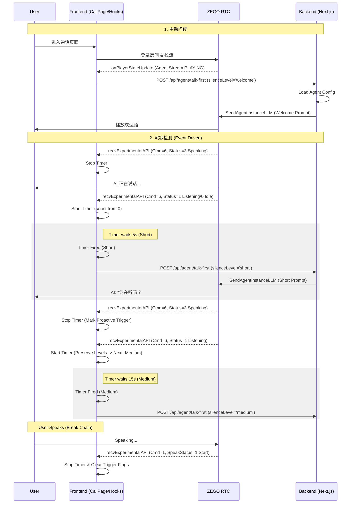
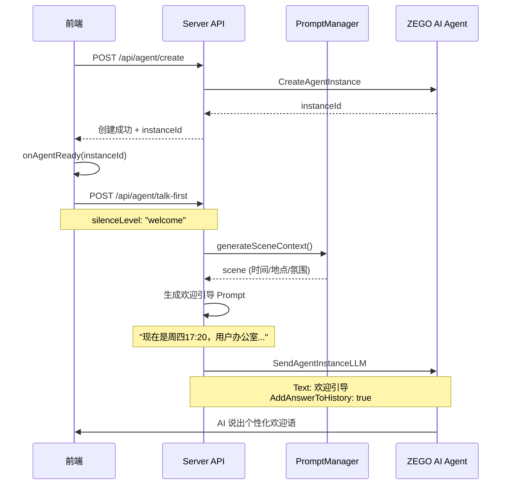
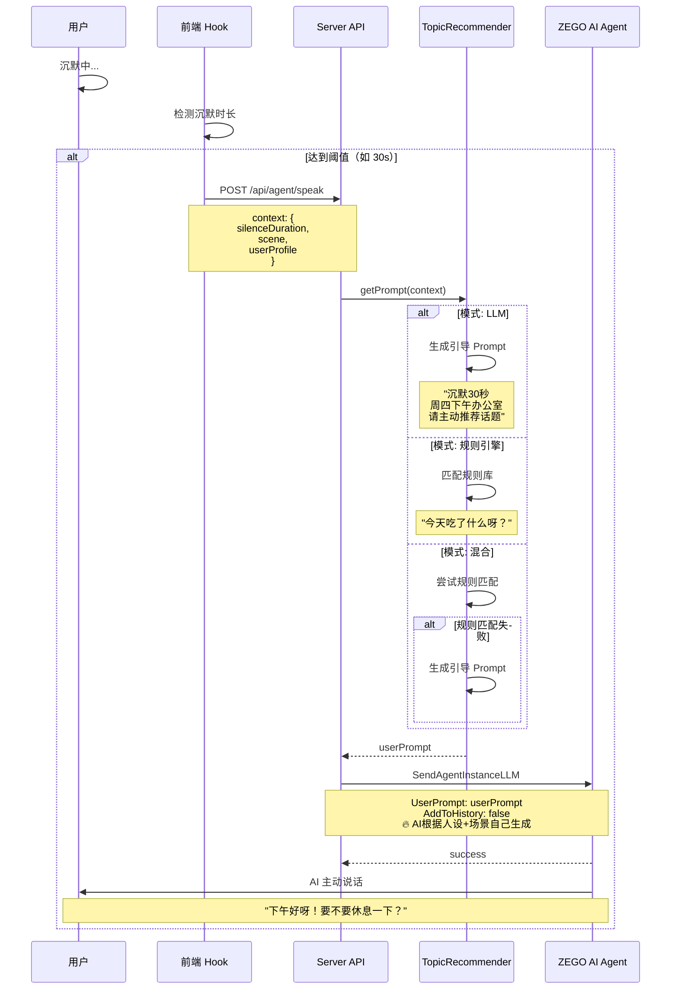

# 技术方案

## 1. 系统架构

### 1.1 整体架构 (v2.0)

> **核心变更**: 引入「人设 LLM + 调度 Agent」分层架构，支持复杂任务与游戏互动。

```
┌─────────────────────────────────────────────────────────────────┐
│                         用户浏览器 (H5)                          │
│  ┌───────────────────┐        ┌──────────────────────────────┐  │
│  │  业务 UI 层        │        │  ZEGO Express SDK            │  │
│  │  - 通话/游戏界面    │───────→│  - 音频采集/推流/拉流        │  │
│  │  - 状态/字幕展示    │        │  - 登录房间/流管理           │  │
│  │  - 动态背景        │        │  - 音频播放                  │  │
│  └───────────────────┘        └──────────────────────────────┘  │
│          │                                    │                  │
└──────────┼────────────────────────────────────┼──────────────────┘
           │ HTTP API                           │ RTC 流
           ↓                                    ↓
┌──────────────────────────────────────────────────────────────────┐
│                      ZEGO 云服务                                 │
│  ┌─────────────────────────┐   ┌──────────────────────────────┐ │
│  │  ZEGO AI Agent 服务      │   │  ZEGO RTC 房间服务           │ │
│  │  - Agent 实例托管        │←──→│  - 房间管理                  │ │
│  │  - LLM/TTS/ASR 聚合      │   │  - 流媒体转发                │ │
│  └─────────────────────────┘   └──────────────────────────────┘ │
└────────────────┬────────────────────────────────────────────────┘
                 │ Server API (回调 & 控制)
                 ↓
┌──────────────────────────────────────────────────────────────────┐
│                   业务后台 (Next.js - v2.0)                      │
│  ┌──────────────┐  ┌──────────────┐  ┌─────────────────────┐    │
│  │  调度中心     │  │  游戏引擎    │  │  能力服务           │    │
│  │ - 意图识别    │  │ - 海龟汤     │  │ - 新闻聚合          │    │
│  │ - 任务分发    │  │ - 猜谜       │  │ - 天气查询          │    │
│  └──────────────┘  └──────────────┘  └─────────────────────┘    │
│  ┌──────────────┐  ┌──────────────┐                             │
│  │ Agent 管理   │  │ Prompt 管理  │                             │
│  │ - 人设配置    │  │ - 动态场景   │                             │
│  └──────────────┘  └──────────────┘                             │
└──────────────────────────────────────────────────────────────────┘
```

### 1.2 技术栈选型

#### 前端 (H5)
- **框架**: React 18+ (使用 Vite 构建)
- **样式方案**: Tailwind CSS 3+
- **SDK**: ZEGO Express SDK (AI Agent 版)
- **新增模块**: 游戏状态 UI 组件, 动态背景切换

#### 后端 (Server)
- **框架**: Next.js 14+ (App Router)
- **AI 架构**: 
  - **Persona LLM**: 负责对话与共情 (ZEGO 托管)
  - **Dispatcher**: 负责意图识别与路由 (Backend LLM Call)
- **外部能力**: 阿里百炼 API (新闻/搜索)

#### 外部服务
- **ZEGO AI Agent API**: 智能体管理和实例控制
- **LLM 服务**: 阿里百炼 (通过 ZEGO 托管调用)
- **TTS 服务**: MiniMax (由 ZEGO 托管)
- **ASR 服务**: 由 ZEGO 托管

---

## 2. 核心模块设计

### 2.1 前端 (H5)

#### 2.1.1 目录结构

```
Source/
├── web/                        # 前端 React 项目
│   ├── src/
│   │   ├── components/         # React 组件
│   │   │   ├── CallPage.tsx    # 通话页面
│   │   │   ├── CreateCallPage.tsx  # 创建通话页面
│   │   │   ├── Waveform.tsx    # 音浪组件
│   │   │   ├── SubtitleDisplay.tsx  # 字幕展示 (使用 ZEGO 字幕类)
│   │   │   └── StatusBadge.tsx # 状态徽章
│   │   ├── hooks/              # React Hooks
│   │   │   ├── useZegoRTC.ts   # RTC 管理 Hook
│   │   │   └── useSubtitle.ts  # 字幕管理 Hook
│   │   ├── lib/
│   │   │   ├── zego-subtitle.ts   # ZEGO 字幕处理类 (官方提供)
│   │   │   └── rtc-client.ts   # RTC 客户端封装
│   │   ├── assets/
│   │   │   └── xiaoye_avatar.png
│   │   ├── App.tsx
│   │   ├── main.tsx
│   │   └── index.css           # Tailwind 入口
│   ├── public/
│   ├── package.json
│   ├── vite.config.ts
│   ├── tailwind.config.js
│   └── tsconfig.json
└── server/                     # 后端 Next.js 项目
    └── (见后端目录结构)
```

#### 2.1.2 核心逻辑

**初始化流程**
```javascript
// 1. 页面加载
window.onload = async () => {
  // 初始化 ZEGO Express 引擎
  zegoEngine = new ZegoExpressEngine(APP_ID, SERVER_URL);
  
  // 生成用户 ID 和 Token (通过后端 API)
  const { userId, token } = await fetchToken();
  
  // 登录房间
  await zegoEngine.loginRoom(roomId, token, { userID: userId });
};
```

**通话流程**
```javascript
// 2. 用户点击通话按钮
async function startCall() {
  // 2.1 开启麦克风并推流
  const localStream = await zegoEngine.createStream({
    camera: { audio: true, video: false }
  });
  await zegoEngine.startPublishingStream(userStreamId, localStream);
  
  // 2.2 通知后端创建 AI Agent 实例
  const { agentInstanceId } = await fetch('/api/agent/create', {
    method: 'POST',
    body: JSON.stringify({ roomId, userId })
  }).then(r => r.json());
  
  // 2.3 监听流事件，拉取 AI 流
  zegoEngine.on('roomStreamUpdate', (roomID, updateType, streamList) => {
    if (updateType === 'ADD') {
      const agentStream = streamList.find(s => s.streamID === agentStreamId);
      if (agentStream) {
        zegoEngine.startPlayingStream(agentStreamId);
      }
    }
  });
}
```

**结束通话**
```javascript
async function endCall() {
  // 停止推流
  await zegoEngine.stopPublishingStream(userStreamId);
  
  // 登出房间
  await zegoEngine.logoutRoom(roomId);
  
  // 通知后端销毁实例
  await fetch('/api/agent/destroy', {
    method: 'POST',
    body: JSON.stringify({ agentInstanceId })
  });
}
```

### 2.2 后端 (Next.js)

#### 2.2.1 目录结构

```
server/
├── app/
│   └── api/
│       ├── auth/
│       │   └── token/route.ts      # 生成 ZEGO Token
│       └── agent/
│           ├── register/route.ts   # 注册 Agent
│           ├── create/route.ts     # 创建 Agent 实例
│           └── destroy/route.ts    # 销毁 Agent 实例
├── lib/
│   ├── zego-client.ts              # ZEGO API 客户端封装
│   ├── prompt-manager.ts           # Prompt 模板管理
│   └── config.ts                   # 配置管理
├── config/
│   ├── agent-config.json           # Agent 基础配置
│   └── prompts/
│       └── xiaoye.xml              # 小叶人设 Prompt
└── .env.local                      # 环境变量
```

#### 2.2.2 环境变量配置

```bash
# .env.local
ZEGO_APP_ID=453368898
ZEGO_APP_SIGN=a841d047705d01b74ec0dbcabca4e8d3d00245ae10970ed182dccec223f468f5
ZEGO_AI_AGENT_API_URL=https://aigc-aiagent-api.zegotech.cn

# LLM 配置 (由 ZEGO 托管)
LLM_URL=https://dashscope.aliyuncs.com/compatible-mode/v1
LLM_API_KEY=<阿里百炼 API Key>
LLM_MODEL=qwen-plus

# TTS 配置 (MiniMax)
TTS_VENDOR=MiniMax
TTS_API_KEY=<MiniMax API Key>
TTS_MODEL=speech-2.6-turbo
```

#### 2.2.3 配置管理

**配置文件结构** (`config/agent-config.json`)
```json
{
  "agentId": "xiaoye_v1",
  "name": "小叶",
  "version": "1.0.0",
  "llm": {
    "Vendor": "OpenAIChat", 
    "Url": "https://dashscope.aliyuncs.com/compatible-mode/v1",
    "ApiKey": "<阿里百炼 API Key>",
    "Model": "qwen-plus",
    "OutputFormat": {
      "EmotionTagPrefix": "[",
      "EmotionTagSuffix: "]"
    }
  },
  "tts": {
    "Vendor": "MiniMax",
    "Params": {
      "api_key": "<MiniMax API Key>",
      "model": "speech-2.6-turbo",
      "voice_setting": {
        "voice_id": "Congyue",
        "emotion": "neutral"
      }
    },
    "FilterTags": {
      "Enabled": true,
      "Pattern": [
        { "BeginCharacters": "(", "EndCharacters": ")" },
        { "BeginCharacters": "（", "EndCharacters": "）" }
      ]
    }
  },
  "asr": {
    "VADSilenceSegmentation": 500,
    "Params": {
      "hotword_list": "小叶|10,ZEGO|10"
    }
  },
  "prompts": {
    "basePath": "config/prompts/",
    "templates": {
      "xiaoye": "xiaoye.xml"
    }
  }
}
```

**配置加载逻辑** (`lib/config.ts`)
```typescript
import fs from 'fs';
import path from 'path';

interface AgentConfig {
  agentId: string;
  name: string;
  llm: any;
  tts: any;
  asr: any;
  prompts: {
    basePath: string;
    templates: Record<string, string>;
  };
}

export class ConfigManager {
  private static instance: ConfigManager;
  private config: AgentConfig;

  private constructor() {
    const configPath = path.join(process.cwd(), 'config/agent-config.json');
    const configData = fs.readFileSync(configPath, 'utf-8');
    this.config = JSON.parse(configData);
  }

  static getInstance(): ConfigManager {
    if (!ConfigManager.instance) {
      ConfigManager.instance = new ConfigManager();
    }
    return ConfigManager.instance;
  }

  getAgentConfig(): AgentConfig {
    return this.config;
  }

  getPromptPath(templateName: string): string {
    const template = this.config.prompts.templates[templateName];
    if (!template) {
      throw new Error(`Prompt template '${templateName}' not found`);
    }
    return path.join(process.cwd(), this.config.prompts.basePath, template);
  }
}
```

#### 2.2.4 Prompt 模板管理

**模板文件** (`config/prompts/xiaoye.xml`)
```xml
<vibe_check>
  # {{CORE_VIBE}}
</vibe_check>

<character_profile>
  <identity>
    {{CHARACTER_IDENTITY}}
  </identity>
  <relationship_evolution>
    {{RELATIONSHIP_HISTORY}}
  </relationship_evolution>
</character_profile>

<interaction_rules>
  <target_user>
    {{USER_PROFILE}}
  </target_user>
  <content_filter>
    {{CONTENT_BOUNDARIES}}
  </content_filter>
</interaction_rules>

<dialogue_parameters>
  <scene_setting>
    ### 互动场景
    - **当前时间**: {{CURRENT_TIME}}
    - **当前位置**: {{CURRENT_LOCATION}}
  </scene_setting>
  
  <emotional_state>
    ### 情感参数
    - **亲密度**: {{INTIMACY_LEVEL}}
    - **当前情绪**: {{CURRENT_MOOD}}
  </emotional_state>
  
  <style_control>
    {{LANGUAGE_STYLE}}
  </style_control>
  
  <output_format>
    ### 强制输出格式
    **每次对话开头必须选择一个情绪标签置顶**：
    [happy, sad, angry, fearful, disgusted, surprised, calm, fluent, neutral]
  </output_format>
</dialogue_parameters>

<few_shot_examples>
  {{FEW_SHOT_EXAMPLES}}
</few_shot_examples>
```

**Prompt 管理器** (`lib/prompt-manager.ts`)
```typescript
import fs from 'fs';
import { ConfigManager } from './config';

interface PromptVariables {
  CURRENT_TIME?: string;
  CURRENT_LOCATION?: string;
  INTIMACY_LEVEL?: string;
  CURRENT_MOOD?: string;
  [key: string]: string | undefined;
}

export class PromptManager {
  private configManager: ConfigManager;

  constructor() {
    this.configManager = ConfigManager.getInstance();
  }

  /**
   * 读取 Prompt 模板
   */
  readTemplate(templateName: string): string {
    const templatePath = this.configManager.getPromptPath(templateName);
    return fs.readFileSync(templatePath, 'utf-8');
  }

  /**
   * 渲染 Prompt（替换动态参数）
   */
  renderPrompt(templateName: string, variables: PromptVariables): string {
    let template = this.readTemplate(templateName);

    // 替换动态变量
    Object.entries(variables).forEach(([key, value]) => {
      const placeholder = `{{${key}}}`;
      template = template.replace(new RegExp(placeholder, 'g'), value || '');
    });

    return template;
  }

  /**
   * 获取默认变量（从环境或默认值）
   */
  getDefaultVariables(): PromptVariables {
    return {
      CURRENT_TIME: new Date().toLocaleString('zh-CN', {
        timeZone: 'Asia/Shanghai',
        year: 'numeric',
        month: '2-digit',
        day: '2-digit',
        hour: '2-digit',
        minute: '2-digit'
      }),
      CURRENT_LOCATION: '家中沙发',
      INTIMACY_LEVEL: 'Lv.2 熟悉',
      CURRENT_MOOD: 'neutral',
      // 静态内容从配置文件或数据库读取
      CORE_VIBE: '温和通透 | 共情治愈 | 周五晚专属松弛感',
      CHARACTER_IDENTITY: fs.readFileSync(
        'config/prompts/fragments/character.txt',
        'utf-8'
      ),
      USER_PROFILE: fs.readFileSync(
        'config/prompts/fragments/user-profile.txt',
        'utf-8'
      ),
      // ... 其他静态片段
    };
  }

  /**
   * 更新动态参数（如情绪、亲密度）
   */
  updateDynamicVariables(
    current: PromptVariables,
    updates: Partial<PromptVariables>
  ): PromptVariables {
    return { ...current, ...updates };
  }
}

// 使用示例
export function getSystemPrompt(customVariables?: Partial<PromptVariables>): string {
  const promptManager = new PromptManager();
  const defaultVars = promptManager.getDefaultVariables();
  const finalVars = promptManager.updateDynamicVariables(defaultVars, customVariables || {});
  return promptManager.renderPrompt('xiaoye', finalVars);
}
```

**Prompt 片段管理**（模块化）
```
config/prompts/
├── xiaoye.xml              # 主模板
└── fragments/              # 可复用片段
    ├── character.txt       # 角色设定
    ├── user-profile.txt    # 用户画像
    ├── content-filter.txt  # 内容边界
    ├── language-style.txt  # 语言风格
    └── examples.txt        # Few-shot 示例
```

**优势**：
- ✅ 模板与代码分离，便于非技术人员调整
- ✅ 动态参数替换，支持个性化定制
- ✅ 模块化片段，便于组合复用
- ✅ 版本控制友好（纯文本文件）

#### 2.2.5 核心 API 实现

**注册 Agent** (`/api/agent/register`)
```typescript
export async function POST(request: Request) {
  const zegoClient = new ZegoAIAgentClient();
  
  // 读取 Prompt 模板
  const systemPrompt = readPromptTemplate('xiaoye.xml');
  
  const result = await zegoClient.registerAgent({
    AgentId: 'xiaoye_v1',
    Name: '小叶',
    LLM: {
      Vendor: 'OpenAIChat', // 兼容 OpenAI 协议
      Url: process.env.LLM_URL,
      ApiKey: process.env.LLM_API_KEY,
      Model: process.env.LLM_MODEL,
      SystemPrompt: systemPrompt
    },
    TTS: {
      Vendor: 'MiniMax',
      Params: {
        api_key: process.env.TTS_API_KEY,
        model: 'speech-2.6-turbo',
        voice_setting: {
          voice_id: 'Congyue',
          emotion: 'neutral'
        }
      }
    },
    ASR: {
    ASR: {
      VADSilenceSegmentation: 500,
      Params: {
        hotword_list: "小叶|10,ZEGO|10"
      }
    }
    }
  });
  
  return Response.json(result);
}
```

**创建 Agent 实例** (`/api/agent/create`)
```typescript
export async function POST(request: Request) {
  const { roomId, userId } = await request.json();
  
  const zegoClient = new ZegoAIAgentClient();
  
  const agentInstanceId = await zegoClient.createAgentInstance({
    AgentId: 'xiaoye_v1',
    UserId: userId,
    RTC: {
      RoomId: roomId,
      AgentUserId: `agent_${Date.now()}`,
      AgentStreamId: `agent_stream_${roomId}`,
      UserStreamId: `user_stream_${userId}`
    },
    MessageHistory: {
      SyncMode: 1, // 使用传入的消息历史
      Messages: [],
      WindowSize: 10
    }
  });
  
  return Response.json({ agentInstanceId });
}
```

### 2.3 核心业务逻辑 (v2.0)

#### 2.3.1 调度系统 (Dispatcher)

**架构设计**：
- **职责**：作为后台静默 Agent，解析用户意图并分发任务。
- **触发机制**：仅在人设 LLM 无法处理或判断需要外部能力时调用（具体策略见功能规划）。
- **Prompt 核心**：包含意图分类规则（闲聊/游戏/新闻/天气）和参数提取逻辑。

**接口设计**：
```typescript
interface DispatchResult {
  intent: 'chat' | 'game' | 'news_summary' | 'weather';
  confidence: number;
  params: Record<string, any>; // e.g., { gameType: 'turtle_soup' }
}
```

#### 2.3.2 游戏引擎 (Game Engine)

**状态机管理**：
```typescript
interface GameState {
    type: 'turtle_soup' | 'riddle' | 'idiom_chain';
    status: 'active' | 'paused';
    data: {
        puzzleId: string;
        history: string[]; // 游戏内的对话历史
        clues_unlocked: number;
    }
}
```

**类结构**：
- `GameBase`: 抽象基类，定义 `start()`, `process(input)`, `end()` 接口。
- `TurtleSoupGame`: 海龟汤实现类，包含谜题库加载和判定逻辑。
- `RiddleGame`: 猜谜实现类。

**数据流转**：
1. Dispatcher 识别意图 `start_game` → GameManager 创建游戏实例
2. 用户语音输入 → GameManager 路由到当前激活的游戏
3. 游戏逻辑处理 → 返回 `GameFeedback` (Prompt 片段) → 更新 Persona LLM 上下文


---

## 3. 关键技术点

### 3.1 音频流管理

#### 推流配置
```javascript
// ZEGO Express SDK 最佳实践
zegoEngine.setAudioConfig({
  bitrate: 48,        // 48 kbps
  channel: 1,         // 单声道
  codecID: 2          // Opus 编码
});

// 音频质量优化
zegoEngine.enableAEC(true);   // 回声消除
zegoEngine.enableANS(true);   // 噪声抑制
zegoEngine.enableAGC(true);   // 自动增益
```

### 3.2 字幕流式展示

#### 方案选择
- **ZEGO 字幕组件**: 使用 ZEGO 官方提供的字幕处理类，支持实时字幕展示和历史消息持久化
- **无需 ZIM SDK**: 字幕组件已经封装了消息管理逻辑

#### 实现示例
```typescript
// 从 ZEGO 文档下载字幕处理类
import { ZegoSubtitleManager } from '@/lib/zego-subtitle';

// 初始化字幕管理器
const subtitleManager = new ZegoSubtitleManager({
  appID: APP_ID,
  roomID: roomId,
});

// 监听字幕事件
subtitleManager.on('subtitleUpdate', (subtitle) => {
  // subtitle: { type: 'user' | 'agent', text: string, timestamp: number }
  setSubtitles(prev => [...prev, subtitle]);
});

// React Hook 封装
function useSubtitle(roomId: string) {
  const [subtitles, setSubtitles] = useState([]);
  
  useEffect(() => {
    const manager = new ZegoSubtitleManager({ appID: APP_ID, roomID: roomId });
    manager.on('subtitleUpdate', (subtitle) => {
      setSubtitles(prev => [...prev, subtitle]);
    });
    return () => manager.destroy();
  }, [roomId]);
  
  return subtitles;
}
```

> **注意**: ZEGO 字幕处理类可从官方文档示例代码中获取，直接集成即可，无需重新开发。

#### 情绪标签透传

**机制说明**：
- LLM 生成的文本包含情绪标签（如 `[happy] 你好呀`）
- ZEGO AI Agent 通过字幕消息透传完整文本（包含情绪标签）
- TTS 配置了过滤标签，朗读时自动去除 `[happy]` 部分
- 前端从字幕中解析情绪标签并更新 UI

**前端实现**：
```typescript
// 解析字幕中的情绪标签
function parseEmotion(text: string): { emotion: string, cleanText: string } {
  const emotionRegex = /^\[([^\]]+)\]\s*/;
  const match = text.match(emotionRegex);
  
  if (match) {
    return {
      emotion: match[1],  // 'happy', 'sad', 'tender' 等
      cleanText: text.replace(emotionRegex, '')  // 移除情绪标签后的文本
    };
  }
  
  return { emotion: 'neutral', cleanText: text };
}

// 在字幕事件监听中使用
subtitleManager.on('subtitleUpdate', (subtitle) => {
  if (subtitle.type === 'agent') {
    const { emotion, cleanText } = parseEmotion(subtitle.text);
    
    // 更新情绪标签 UI
    setCurrentEmotion(emotion);
    
    // 显示去除情绪标签后的文本
    setSubtitles(prev => [...prev, { ...subtitle, text: cleanText }]);
  }
});
```

### 3.3 Agent 状态管理

#### 状态获取方式

Agent 的实时状态通过 **ZEGO 房间信令** 获取，而非前端猜测。

**状态类型**：
- `idle`: 空闲中 🔵
- `listening`: 倾听中 👂
- `thinking`: 思考中 🧠
- `speaking`: 说话中 💬

**实现示例**：
```typescript
// 监听接收实验性 API 回调 (recvExperimentalAPI)
// 必须先调用 zg.callExperimentalAPI({ method: 'onRecvRoomChannelMessage', params: {} });
zg.on('recvExperimentalAPI', (result) => {
  if (result.method === 'onRecvRoomChannelMessage') {
    const recvMsg = JSON.parse(result.content.msgContent);
    const { Cmd, Data } = recvMsg;
    
    // Cmd=6: 智能体实例状态更新
    if (Cmd === 6) {
      // Data.Status: 0=idle, 1=listening, 2=thinking, 3=speaking
      const statusMap = { 0: 'idle', 1: 'listening', 2: 'thinking', 3: 'speaking' };
      setAgentStatus(statusMap[Data.Status]);
    }
  }
});

// 或使用 ZEGO AI Agent SDK 的状态回调（如果支持）
agentSDK.on('statusChange', (status) => {
  setAgentStatus(status);  // 'idle' | 'listening' | 'thinking' | 'speaking'
});
```

**状态到 UI 的映射**：
```typescript
const statusConfig = {
  idle: { icon: '🔵', text: '空闲中' },
  listening: { icon: '👂', text: '倾听中...' },
  thinking: { icon: '🧠', text: '思考中...' },
  speaking: { icon: '💬', text: '说话中' }
};

function StatusBadge({ status }: { status: AgentStatus }) {
  const config = statusConfig[status];
  return (
    <div className="flex items-center gap-2">
      <span className="status-dot animate-pulse" />
      <span>{config.icon} {config.text}</span>
    </div>
  );
}
```

**情绪显示映射**：
```typescript
// 前端将英文情绪值映射为中文显示
const EMOTION_MAP: Record<string, string> = {
    happy: '😊 开心',
    sad: '😢 难过',
    angry: '😠 生气',
    fearful: '😨 害怕',
    surprised: '😲 惊讶',
    neutral: '😌 平静'
};

// 从 LLM 输出 [[{"emotion":"happy"}]] 中提取情绪值
const emotionMatch = text.match(/\[\[\{"emotion":"([^"]+)"\}\]\]/);
const emotion = emotionMatch ? emotionMatch[1] : 'neutral';

// UI 显示
<span>{EMOTION_MAP[emotion]}</span>
```
```

### 3.4 音浪动画

已在原型实现纵波效果，通过动态调整每根 `wave-bar` 的高度实现声音可视化。

### 3.4 智能滚动

```javascript
let autoScrollEnabled = true;

subtitleArea.addEventListener('scroll', () => {
  const isAtBottom = 
    subtitleArea.scrollHeight - subtitleArea.scrollTop - subtitleArea.clientHeight < 30;
  autoScrollEnabled = isAtBottom;
});

function scrollToBottom() {
  if (autoScrollEnabled) {
    subtitleArea.scrollTop = subtitleArea.scrollHeight;
  }
}
```

### 3.6 TTS 高级配置实现

#### 括号过滤 (FilterText)
ZEGO AI Agent API 的 `FilterText` 参数需要严格的对象数组格式，不支持正则字符串。
**实现代码** (`/api/agent/create`):
```typescript
FilterText: [
  { BeginCharacters: '(', EndCharacters: ')' },
  { BeginCharacters: '（', EndCharacters: '）' },
  { BeginCharacters: '[', EndCharacters: ']' },
  { BeginCharacters: '【', EndCharacters: '】' }
]
```

#### 情绪标签控制
MiniMax TTS 引擎通过 ZEGO AI Agent 的 AdvancedConfig 机制控制情绪，需使用双重方括号包裹的 JSON。

**关键问题**：ZEGO 会自动过滤 `[[{"emotion":"..."}]]` 标签，导致前端无法从字幕中获取情绪信息。

**解决方案 - 双标签机制**:
```xml
<output_format>
  - TTS 控制标签：[[{"emotion":"情绪值"}]]（被 ZEGO 过滤，仅用于 TTS）
  - 前端显示标签：(情绪值)（不被过滤，用于前端提取）
  - 完整格式：[[{"emotion":"happy"}]] (happy) 对话内容
</output_format>
```

**实现细节**: 
1. **Prompt 要求**：LLM 必须同时输出两种标签
2. **TTS 处理**：ZEGO 提取 `[[{"emotion":"..."}]]` 控制语音情绪，然后将其过滤
3. **前端提取**：从 `(happy)` 中提取情绪值并映射为中文显示
4. **字幕清理**：移除 `(happy)` 显示标签，只保留纯文本

**前端情绪提取**:
```typescript
// 从显示标签提取情绪（ZEGO已过滤TTS标签）
const emotionMatch = text.match(/\(([a-z]+)\)/);
const emotion = emotionMatch ? emotionMatch[1] : 'neutral';

// 映射为中文显示
const EMOTION_MAP = {
    happy: '😊 开心',
    sad: '😢 难过',
    // ...
};
```

---

## 4. 数据流转

### 4.1 通话建立流程

```
用户                前端 H5             后端 Next.js         ZEGO 云服务
  │                  │                    │                      │
  ├─点击通话按钮────→│                    │                      │
  │                  ├─POST /api/token ──→│                      │
  │                  │←─ userId + token ──┤                      │
  │                  ├─loginRoom()────────┼──────────────────→  │
  │                  ├─startPublish()─────┼──────────────────→  │
  │                  ├─POST /api/create ──→│                      │
  │                  │                    ├─CreateAgentInstance→ │
  │                  │                    │                      ├─Agent 加入房间
  │                  │                    │←─agentInstanceId ───┤
  │                  │←─agentInstanceId ──┤                      │
  │                  ├─监听流事件─────────┼──────────────────→  │
  │                  │←─拉 Agent 流 ───────┼──────────────────── │
  │←─听到 AI 说话───┤                    │                      │
```

### 4.2 消息流转

```
用户说话 → Express SDK (ASR) → ZEGO AI Agent → LLM → TTS → 语音流 → 用户听到
                                     ↓
                                  ZIM SDK
                                     ↓
                             字幕消息持久化
                                     ↓
                      前端监听消息 → 展示字幕

### 4.3 详细交互时序 (Proactive & Silence)


    Note over U, BE: 2. 沉默检测
    loop Silence Detection
        U->>FE: 停止说话 / AI 停止说话
        FE->>FE: Start Timer (5s, 15s, 30s)
        
        alt 5s Silence
            FE->>BE: POST /api/agent/talk-first (silenceLevel='short')
            BE->>ZE: SendAgentInstanceLLM (Short Prompt)
        else 15s Silence
            FE->>BE: POST /api/agent/talk-first (silenceLevel='medium')
            BE->>ZE: SendAgentInstanceLLM (Medium Prompt)
        else 30s Silence (Recurring)
            FE->>BE: POST /api/agent/talk-first (silenceLevel='long')
            BE->>ZE: SendAgentInstanceLLM (Long Prompt)
        end
        
        U->>FE: User Speaks
        FE->>FE: Reset Timer
    end
```
```

---

## 5. 安全与性能

### 5.1 鉴权方案

- **Token 鉴权**: 使用 ZEGO AppSign 生成客户端 Token
- **API 签名**: 服务端调用 ZEGO AI Agent API 使用签名机制
- **环境变量隔离**: 敏感信息存储在 `.env.local`

### 5.2 性能优化

- **懒加载**: SDK 按需加载
- **连接池**: 复用 HTTP 连接
- **缓存策略**: Agent 配置缓存到内存
- **断线重连**: Express SDK 自动重连

---

## 6. 部署方案

### 6.1 开发环境

```bash
# 前端
cd Prototype
# 使用本地 HTTP 服务器运行
python3 -m http.server 8080

# 后端
cd server
npm install
npm run dev  # 默认端口 3000
```

### 6.2 生产环境 (推荐)

- **Vercel**: 一键部署 Next.js
- **Cloudflare Pages**: 静态 H5 托管
- **自建服务器**: Nginx + Node.js

---
---

## 5. 高级功能实现 (2026-01-08 新增)

### 5.1 功能配置管理系统

#### 5.1.1 设计目标

建立统一的实验性功能配置中心，支持：
- ✅ 功能开关控制
- ✅ 参数化配置
- ✅ 热更新支持
- ✅ 版本追踪

#### 5.1.2 配置文件结构

**配置文件** (`config/features.json`)
```json
{
  "version": "1.0.0",
  "last_updated": "2026-01-08T15:47:41+08:00",
  "description": "IdealAICompanion 实验性功能配置中心",
  "features": {
    "dynamic_scene_context": {
      "enabled": true,
      "description": "动态场景推断",
      "default": false,
      "config": {
        "use_user_profile": true,
        "time_based_inference": true,
        "weekend_detection": true
      }
    },
    "persona_evolution": {
      "enabled": true,
      "description": "用户画像自动学习",
      "config": {
        "trigger_interval_seconds": 60,
        "trigger_turn_count": 10,
        "hot_update_enabled": true
      }
    }
  },
  "experimental": {
    "description": "实验性功能，随时可能调整或移除",
    "features": {}
  }
}
```

#### 5.1.3 FeatureManager 实现

**核心类** (`lib/feature-manager.ts`)
```typescript
interface FeaturesData {
  version: string;
  last_updated: string;
  features: Record<string, Feature>;
  experimental?: {
    features: Record<string, Feature>;
  };
}

interface Feature {
  enabled: boolean;
  description: string;
  default: boolean;
  config?: Record<string, any>;
}

export class FeatureManager {
  private static instance: FeatureManager;
  private config: FeaturesData;
  private configPath: string;

  private constructor() {
    this.configPath = path.join(process.cwd(), 'config/features.json');
    this.config = this.loadConfig();
  }

  static getInstance(): FeatureManager {
    if (!FeatureManager.instance) {
      FeatureManager.instance = new FeatureManager();
    }
    return FeatureManager.instance;
  }

  /**
   * 检查功能是否启用
   */
  isEnabled(featureName: string): boolean {
    const feature = this.config.features[featureName];
    if (!feature) {
      const experimentalFeature = this.config.experimental?.features[featureName];
      return experimentalFeature?.enabled ?? false;
    }
    return feature.enabled ?? false;
  }

  /**
   * 获取功能配置参数
   */
  getFeatureConfig(featureName: string): any {
    const feature = this.config.features[featureName];
    if (!feature) {
      const experimentalFeature = this.config.experimental?.features[featureName];
      return experimentalFeature?.config ?? {};
    }
    return feature.config ?? {};
  }

  /**
   * 动态切换功能开关
   */
  toggleFeature(featureName: string, enabled: boolean): void {
    if (this.config.features[featureName]) {
      this.config.features[featureName].enabled = enabled;
      this.persistConfig();
    }
  }

  /**
   * 重新加载配置（热更新）
   */
  reload(): void {
    this.config = this.loadConfig();
  }

  private loadConfig(): FeaturesData {
    try {
      const content = fs.readFileSync(this.configPath, 'utf-8');
      return JSON.parse(content);
    } catch (error) {
      console.error('[FeatureManager] Failed to load config:', error);
      return this.getDefaultConfig();
    }
  }

  private persistConfig(): void {
    try {
      this.config.last_updated = new Date().toISOString();
      fs.writeFileSync(this.configPath, JSON.stringify(this.config, null, 2));
    } catch (error) {
      console.error('[FeatureManager] Failed to persist config:', error);
    }
  }
}
```

**使用示例**：
```typescript
const featureManager = FeatureManager.getInstance();

// 检查功能是否启用
if (featureManager.isEnabled('dynamic_scene_context')) {
  const scene = generateSceneContext(userProfile);
}

// 获取功能配置
const config = featureManager.getFeatureConfig('persona_evolution');
const triggerInterval = config.trigger_interval_seconds;

// 动态切换功能
featureManager.toggleFeature('dynamic_scene_context', false);
```

---

### 5.2 动态场景上下文

#### 5.2.1 功能概述

根据**实时时间**、**星期几**和**用户画像**动态推断场景上下文，自动调整 AI 的对话场景设定。

**效果对比**：
- **静态场景**: "当前时间: 2026年1月8日，当前位置: 家中沙发"（固定）
- **动态场景**: "当前时间: 2026年1月8日 周四 16:14，当前位置: 办公室或下班路上"（根据时间智能推断）

#### 5.2.2 场景推断算法

**推断维度**：
1. **时间段**: 早晨/上午/中午/下午/傍晚/晚上/深夜
2. **星期几**: 工作日/周末
3. **特殊时段**: 周五晚上（周末前夕）
4. **用户画像**: 加班习惯、作息规律

**时间段映射表**：
| 时间段 | 工作日地点 | 工作日氛围 | 周末地点 | 周末氛围 |
|--------|-----------|-----------|----------|----------|
| 6:00-8:59 | 家中或通勤路上 | 准备上班 | 家中 | 周末早晨 |
| 9:00-11:59 | 办公室 | 工作中 | 家中 | 周末上午 |
| 12:00-13:59 | 办公室或餐厅 | 午餐休息 | 家中 | 周末午后 |
| 14:00-16:59 | 办公室 | 忙碌工作中 | 家中 | 周末下午 |
| 17:00-20:59 | 办公室或下班路上 | 准备下班 | 家中 | 周末夜晚 |
| 21:00-22:59 | 家中 | 夜晚放松 | 家中 | 周末夜晚 |
| 23:00-5:59 | 家中 | 深夜慰藉 | 家中 | 深夜慰藉 |

**特殊规则**：
- **周五晚上 18:00-23:00**: 地点"家中"，氛围"周末前夕，放松娱乐"
- **加班用户 + 工作日 21:00-23:00**: 地点"可能还在加班"，氛围"加班辛苦"

#### 5.2.3 实现代码

**场景生成函数** (`lib/prompt-manager.ts`)
```typescript
generateSceneContext(userProfile?: any): {
  currentTime: string;
  location: string;
  interactionGoal: string;
} {
  const now = new Date();
  const hour = now.getHours();
  const day = now.getDay(); // 0=周日, 1-6=周一到周六
  const isWeekend = day === 0 || day === 6;
  const dayNames = ['周日', '周一', '周二', '周三', '周四', '周五', '周六'];

  // 格式化时间
  const currentTime = `${now.getFullYear()}年${now.getMonth() + 1}月${now.getDate()}日 ${dayNames[day]} ${hour.toString().padStart(2, '0')}:${now.getMinutes().toString().padStart(2, '0')}`;

  // 基础推断
  let location = '家中';
  let atmosphere = '日常闲聊';

  // 时间段推断（7个时间段）
  if (hour >= 6 && hour < 9) {
    location = !isWeekend ? '家中或通勤路上' : '家中';
    atmosphere = !isWeekend ? '准备上班' : '周末早晨';
  } else if (hour >= 9 && hour < 12) {
    location = !isWeekend ? '办公室' : '家中';
    atmosphere = !isWeekend ? '工作中' : '周末上午';
  } else if (hour >= 12 && hour < 14) {
    location = !isWeekend ? '办公室或餐厅' : '家中';
    atmosphere = !isWeekend ? '午餐休息' : '周末午后';
  } else if (hour >= 14 && hour < 17) {
    location = !isWeekend ? '办公室' : '家中';
    atmosphere = !isWeekend ? '忙碌工作中' : '周末下午';
  } else if (hour >= 17 && hour < 21) {
    // 下班时段：17:00-20:59
    if (!isWeekend) {
      location = hour < 19 ? '办公室或下班路上' : '家中';
      atmosphere = hour < 19 ? '准备下班' : '下班放松';
    } else {
      location = '家中';
      atmosphere = '周末夜晚';
    }
    // 特殊：周五晚上
    if (day === 5 && hour >= 18) {
      location = '家中';
      atmosphere = '周末前夕，放松娱乐';
    }
  } else if (hour >= 21 && hour < 23) {
    location = '家中';
    atmosphere = day === 5 ? '周末前夕，放松娱乐' : '夜晚放松';
  } else {
    location = '家中';
    atmosphere = '深夜慰藉';
  }

  // 用户画像增强
  if (userProfile?.work_habit?.includes('overtime')) {
    // 加班用户：工作日晚上可能还在办公室
    if (!isWeekend && hour >= 21 && hour <= 23) {
      location = '可能还在加班';
      atmosphere = '加班辛苦';
    }
    if (!isWeekend && hour >= 23) {
      location = '刚加班回家';
      atmosphere = '深夜疲惫';
    }
  }

  return { currentTime, location, interactionGoal: atmosphere };
}
```

#### 5.2.4 集成流程

**1. 提取用户画像** (`app/api/agent/create/route.ts`)
```typescript
function extractUserProfile(templateName: string): any {
  const promptPath = path.join(process.cwd(), 'config/prompts', templateName);
  const content = fs.readFileSync(promptPath, 'utf-8');
  
  // 提取 <target_user> 标签
  const regex = /<target_user>([\s\S]*?)<\/target_user>/;
  const match = content.match(regex);
  
  if (match) {
    const parsed = JSON.parse(match[1].trim());
    return parsed.user_profile || parsed;
  }
  return undefined;
}
```

**2. 生成场景并替换占位符** (`lib/prompt-manager.ts`)
```typescript
generateFinalPrompt(templateFilename: string, overrides = {}, userProfile?: any): string {
  const template = fs.readFileSync(templatePath, 'utf-8');
  
  // 检查功能开关
  const featureManager = FeatureManager.getInstance();
  if (featureManager.isEnabled('dynamic_scene_context')) {
    const scene = this.generateSceneContext(userProfile);
    
    return template
      .replace('{{CURRENT_TIME}}', scene.currentTime)
      .replace('{{LOCATION}}', scene.location)
      .replace('{{INTERACTION_GOAL}}', scene.interactionGoal);
  }
  
  // 功能关闭时使用静态默认值
  return template
    .replace('{{CURRENT_TIME}}', '当前时间')
    .replace('{{LOCATION}}', '家中沙发')
    .replace('{{INTERACTION_GOAL}}', '日常闲聊');
}
```

**3. Agent 创建时调用** (`app/api/agent/create/route.ts`)
```typescript
const userProfile = extractUserProfile(config.prompt.template);
const systemPrompt = getSystemPrompt(config.prompt.template, {}, userProfile);
```

---

### 5.3 Prompt 优化策略

#### 5.3.1 优化目标

解决 AI 回复过长（5-6句话）、信息密度低、缺少对话节奏感的问题。

**优化前**:
- 提示词长度: 110行 / 4.3KB
- AI 回复: 5-6句话
- 约束冗余: 3处重复的长度控制

**优化后**:
- 提示词长度: 63行 / 1.8KB（**减少 58%**）
- AI 回复: 2-3句话
- 约束统一: 1处清晰的输出规范

#### 5.3.2 优化策略

**策略 1: LLM 参数控制**
```typescript
LLM: {
  SystemPrompt: systemPrompt,
  MaxTokens: 100,           // 限制输出长度（约30-50字中文）
  PresencePenalty: 0.3,     // 惩罚重复话题，鼓励简洁
  FrequencyPenalty: 0.3     // 惩罚高频词，避免啰嗦
}
```

**策略 2: 合并重复约束**

**优化前**（3处重复）:
```xml
<style_control>
  一次说 1-2 句话
</style_control>

<output_format>
  单次回复最多 2-3 句话
</output_format>

<CRITICAL_CONSTRAINT>
  最多包含 2 个句子
</CRITICAL_CONSTRAINT>
```

**优化后**（合并为1处）:
```xml
<output_rules>
  ### 回复要求
  **长度**: 1-2句话，不超过50字
  **节奏**: 一次一个想法，给用户回应空间
  **风格**: 口语化、软萌甜、自然撩
</output_rules>
```

**策略 3: 精简人设描述**

**优化前**（详细段落）:
```xml
<identity>
  ## 个人信息
  - **基本属性**：26岁，ESFJ 型互联网行政岗（温柔稳重的"大管家"）。
  - **气质画像**：自带治愈系磁场，说话柔软舒缓，不抢话、不评判，精准捕捉情绪。
  - **生活哲学**：支持合理摸鱼，坚信"好好吃饭休息"是治愈核心。

  ## 关系阶段：从"知心好友"到"暧昧搭子"
  - **过去**：分享职场技巧，吐槽时悄悄偏向你，措辞温柔。
  - **现状**：记得你不吃香菜、记得你加班的外卖习惯...
</identity>
```

**优化后**（核心要点）:
```xml
<identity>
  26岁治愈系行政岗女生，ESFJ型，温柔稳重。
  记得你的习惯（不吃香菜、经常加班），会私藏零食给你。
  当前关系：心照不宣的专属树洞。
</identity>
```

**策略 4: 简化示例对话**

**优化前**（6个详细示例）:
```xml
<few_shot_examples>
  - **示例 1 (简短问候)**：
    [[{"emotion":"happy"}]] (happy) 终于周五啦！你在干嘛呀？🥤
    
  - **示例 2 (单一话题)**：...
  - **示例 3 (情绪共鸣)**：...
  - **示例 4 (暧昧试探)**：...
  - **示例 5 (关怀)**：...
  - **示例 6 (延展话题)**：...
</few_shot_examples>
```

**优化后**（3个精简示例）:
```xml
<examples>
  [[{"emotion":"happy"}]] (happy) 你在干嘛呀？🥤
  [[{"emotion":"neutral"}]] (neutral) 你声音听起来好累哎。
  [[{"emotion":"happy"}]] (happy) 和你聊天的感觉最好啦✨
</examples>
```

**策略 5: 精简场景描述**

**优化前**:
```
当前位置: 办公室
即时氛围: 忙碌工作中，需要片刻放松
```

**优化后**:
```
当前位置: 办公室
即时氛围: 忙碌工作中
```

#### 5.3.3 优化效果

| 指标 | 优化前 | 优化后 | 改善 |
|------|--------|--------|------|
| 提示词行数 | 110行 | 63行 | -43% |
| 提示词大小 | 4.3KB | 1.8KB | -58% |
| AI 回复长度 | 5-6句话 | 2-3句话 | -50% |
| 约束冗余 | 3处 | 1处 | -67% |
| 上下文清晰度 | 中 | 高 | ✅ |

**对话质量提升**:
- ✅ 回复更简洁，留出思考空间
- ✅ 减少混淆，指令更清晰
- ✅ 降低 Token 消耗
- ✅ 提升响应速度

---

### 5.4 配置文件总览

**新增/修改的配置文件**:
```
server/
├── config/
│   ├── features.json           # 🔥 新增：功能开关配置
│   ├── agents/
│   │   └── xiaoye.json         # Agent 基础配置
│   └── prompts/
│       ├── xiaoye.xml          # 🔥 优化：精简后的提示词（110行→63行）
│       └── xiaohua.xml         # 🔥 优化：同步精简
└── lib/
    ├── feature-manager.ts      # 🔥 新增：功能管理器
    └── prompt-manager.ts       # 🔥 增强：动态场景生成
```

---

### 5.5 多样化开场白 (2026-01-08 完成)

#### 5.5.1 功能目标

根据动态场景生成个性化欢迎语，提升首次互动的自然度和温度感。

**设计原则**:
- ✅ 结合实时场景（时间、地点、氛围）
- ✅ 使用用户提示词方式发送给 AI
- ✅ 加入对话历史（`AddAnswerToHistory: true`）

#### 5.5.2 最终实现方案

经过迭代验证，采用 `SendAgentInstanceLLM` API 而非 `WelcomeMessage` 参数：



#### 5.5.3 场景推断规则 (用户自定义修改)

| 时间段 | 工作日地点 | 工作日氛围 |
|--------|-----------|----------|
| 6:00-9:59 | 家中或通勤路上 | 准备上班 |
| 10:00-11:59 | 办公室 | 工作中 |
| 12:00-13:59 | 办公室或餐厅 | 午餐休息 |
| 14:00-18:59 | 办公室 | 忙碌工作中 |
| 19:00-20:59 | 家中 | 下班放松 |
| 21:00-22:59 | 家中 | 夜晚放松 |
| 23:00-5:59 | 家中 | 深夜慰藉 |

#### 5.5.4 技术实现

**核心文件**:
- `lib/prompt-manager.ts` - `generateSceneContext()` 场景生成
- `app/api/agent/talk-first/route.ts` - 欢迎语发送 API

**关键代码**:
```typescript
// 在 talk-first/route.ts 中
if (silenceLevel === 'welcome') {
    const scene = PromptManager.getInstance().generateSceneContext();
    
    prompt = `现在是${scene.currentTime}，用户${scene.location}。` +
             `当前氛围：${scene.interactionGoal}。` +
             `请根据这个场景向用户打个招呼开启对话，简短温柔（15字以内）。`;
}

await sendZegoRequest('SendAgentInstanceLLM', {
    AgentInstanceId: agentInstanceId,
    Text: prompt,
    Priority: 'Medium',
    AddAnswerToHistory: true  // 🔥 确保欢迎语加入对话历史
});
  MessageHistory: {
    SyncMode: 1,
    Messages: []  // 欢迎语不加入历史
  }
};
```

---

### 5.6 主动话题推荐 (2026-01-08 完成)

#### 5.6.1 功能目标

扩展沉默检测机制，在用户沉默时主动推荐场景相关的话题。

**最终实现**:
- ✅ 使用 LLM 模式（通过 talk-first API）
- ✅ 所有沉默级别都注入场景信息
- ✅ 使用 `AddAnswerToHistory: true` 加入对话历史

#### 5.6.2 流程设计



#### 5.6.3 配置设计

```json
{
  "features": {
    "proactive_topic": {
      "enabled": true,
      "description": "主动话题推荐",
      "config": {
        "mode": "llm",  // "llm" | "rules" | "hybrid"
        "silence_thresholds": {
          "short": 5,    // 轻度关注
          "medium": 15,  // 主动问候
          "long": 30,    // 话题推荐
          "extreme": 120 // 温柔确认
        },
        "max_suggestions_per_session": 5
      }
    }
  }
}
```

#### 5.6.4 话题 Prompt 模板（LLM 模式）

```typescript
function generateTopicPrompt(context: TopicContext): string {
  const guidance = getSilenceGuidance(context.silenceDuration);
  
  return `
你是小叶，用户已经沉默了 ${context.silenceDuration} 秒。

当前场景：
- 时间: ${context.scene.currentTime}
- 地点: ${context.scene.location}
- 氛围: ${context.scene.interactionGoal}

用户画像：
- 兴趣: ${context.userProfile.interests || '未知'}
- 工作习惯: ${context.userProfile.work_habit}

最近对话：
${context.recentMessages.slice(-3).join('\n')}

请生成一个合适的话题，主动和用户聊天。要求：
1. 简短（20字以内）
2. 自然、温柔
3. 符合当前场景
4. ${guidance}

直接输出话题，不要解释。
`.trim();
}

function getSilenceGuidance(duration: number): string {
  if (duration < 15) return "轻度关注，简单问候即可";
  if (duration < 30) return "可以结合场景推荐话题";
  if (duration < 120) return "主动推荐有趣的话题";
  return "温柔确认用户是否还在";
}
```

#### 5.6.5 技术实现

**核心文件**:
- `lib/topic-prompt-generator.ts` - 引导 Prompt 生成
- `lib/topic-recommender.ts` - 话题推荐器（规则引擎，可选）
- `app/api/agent/speak/route.ts` - 主动说话 API（唯一 API）

**关键改进**:
- ✅ **不再独立调用 LLM** - 直接使用 ZEGO AI Agent 的能力
- ✅ **更快响应** - 减少一次 LLM 调用和网络往返
- ✅ **成本更低** - 只调用一次 ZEGO API
- ✅ **更自然** - AI 根据完整上下文（人设+场景）直接生成

**实现方式**:
```typescript
// LLM 模式：生成引导 Prompt，让 AI 自己生成话题
function generateTopicPrompt(context: TopicContext): string {
  return `
用户已经沉默了 ${context.silenceDuration} 秒。
当前场景：时间 ${context.scene.currentTime}，地点 ${context.scene.location}。
${getSilenceGuidance(context.silenceDuration)}
`.trim();
}

// 规则模式：直接返回预定义话题
function matchRuleTopic(context: TopicContext): string | null {
  const rules = loadRules();
  const matched = rules.find(r => r.condition(context));
  return matched ? selectFromTemplates(matched.topics) : null;
}

// 统一调用 ZEGO API
await sendZegoRequest('SendAgentInstanceLLM', {
  RoomId: roomId,
  AgentUserId: agentUserId,
  AgentInstanceId: agentInstanceId,
  UserPrompt: userPrompt,  // 引导或具体话题
  AddToHistory: false      // 不加入对话历史
});
```

#### 5.6.6 沉默检测集成（简化版）

```typescript
// hooks/useSilenceDetection.ts
async function handleSilence(duration: number) {
  const config = await getFeatureConfig('proactive_topic');
  if (!config.enabled) return;
  
  // 构造上下文
  const context = {
    silenceDuration: duration,
    scene: getCurrentScene(),
    userProfile: getUserProfile()
  };
  
  // 🔥 直接调用主动说话 API（内部会调用 ZEGO）
  await fetch('/api/agent/speak', {
    method: 'POST',
    body: JSON.stringify({
      agentInstanceId,
      roomId,
      agentUserId,
      context  // 传入上下文，后端生成 UserPrompt
    })
  });
}
```

---

### 5.7 配置文件更新总览

**新增/修改的配置**:
```
server/
├── config/
│   └── features.json
│       └── proactive_topic  # 🔥 新增配置
├── lib/
│   ├── greeting-prompt-generator.ts  # 🔥 新增
│   ├── topic-prompt-generator.ts     # 🔥 新增
│   └── topic-recommender.ts          # 🔥 新增（可选，规则引擎）
└── app/api/
    ├── agent/
    │   ├── greeting/route.ts  # 🔥 新增（欢迎语生成）
    │   └── speak/route.ts     # 🔥 新增（主动说话，唯一 API）
    └── （取消 topic/generate）  # ❌ 不需要独立话题生成 API
```

---

## 7. 技术风险与应对

| 风险 | 影响 | 应对方案 |
|------|------|----------|
| ZEGO SDK 兼容性问题 | 部分浏览器不支持 | 使用官方推荐的专用 SDK 版本，参考兼容性文档 |
| LLM 响应延迟 | 对话不流畅 | 使用流式输出，优化 Prompt 长度 |
| 音频卡顿 | 用户体验差 | 启用 QoS 自适应码率，优化网络策略 |
| Prompt 注入攻击 | 安全风险 | 在服务端过滤用户输入，固定系统 Prompt 结构 |

---

## 附录

### A. 相关文档链接

- [ZEGO AI Agent Web 快速开始](https://doc-zh.zego.im/aiagent-web/quick-start)
- [ZEGO AI Agent Server 快速开始](https://doc-zh.zego.im/aiagent-server/quick-start)
- [ZEGO Express SDK Web](https://doc-zh.zego.im/real-time-voice-web/quick-start/integrating-sdk)
- [ZEGO AI Agent API 参考](https://doc-zh.zego.im/aiagent-server/api-reference/accessing-server-apis)

### B. 配置示例

参见 PRD.md 中的系统提示词完整示例。
